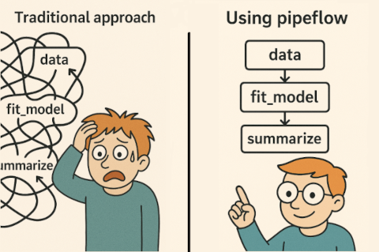

<!-- README.md is generated from README.Rmd. Please edit that file -->
<!-- badges: start -->

[](https://cran.r-project.org/package=pipeflow)
[](https://CRAN.R-project.org/package=pipeflow)
[](https://app.codecov.io/gh/rpahl/pipeflow)
[](https://github.com/rpahl/pipeflow/actions)
[](https://github.com/rpahl/pipeflow/actions)
[](https://github.com/rpahl/pipeflow/actions)
<!-- [](https://cran.r-project.org/web/checks/check_results_pipeflow.html) -->
[](https://cran.r-project.org/package=pipeflow)
[](https://cran.r-project.org/package=pipeflow)
[](https://github.com/rpahl/pipeflow/commits/main)
[](https://lifecycle.r-lib.org/articles/stages.html#experimental)

<!-- badges: end -->

# pipeflow 

A lightweight yet powerful framework for building robust data analysis
pipelines. With `pipeflow`, you initialize a pipeline with your dataset
and construct workflows step by step simply by adding R functions. You
can modify, remove, or insert steps and parameters at any stage, while
`pipeflow` ensures the pipeline’s integrity.

Thanks to its intuitive interface, using `pipeflow` quickly pays off in
the beginning while in the long run will help you to keep a clear and
structured overview of your project.



### Why use `pipeflow`

- Easy to learn yet suited for growingly complex workflows
- Automatically manages function and parameter dependencies
- Promotes structured and modular code
- Facilitates reusability and collaboration
- Simplifies error handling and debugging

### Installation

``` r
# Install release version from CRAN
install.packages("pipeflow")

# Install development version from GitHub
devtools::install_github("rpahl/pipeflow")
```

### Usage

``` r
library(pipeflow)
```

### Getting Started

It is recommended to read the vignettes in the order they are listed
below:

- [Get started with
  pipeflow](https://rpahl.github.io/pipeflow/articles/v01-get-started.html)
- [Modifying existing
  pipelines](https://rpahl.github.io/pipeflow/articles/v02-modify-pipeline.html)
- [Combining
  pipelines](https://rpahl.github.io/pipeflow/articles/v03-combine-pipelines.html)
- [Collecting
  output](https://rpahl.github.io/pipeflow/articles/v04-collect-output.html)

### Advanced topics

- [How to use pipeflow with split data
  sets](https://rpahl.github.io/pipeflow/articles/v05-split-and-combine.html)
- [How pipelines can modify themselves at
  runtime](https://rpahl.github.io/pipeflow/articles/v06-self-modify-pipeline.html)
