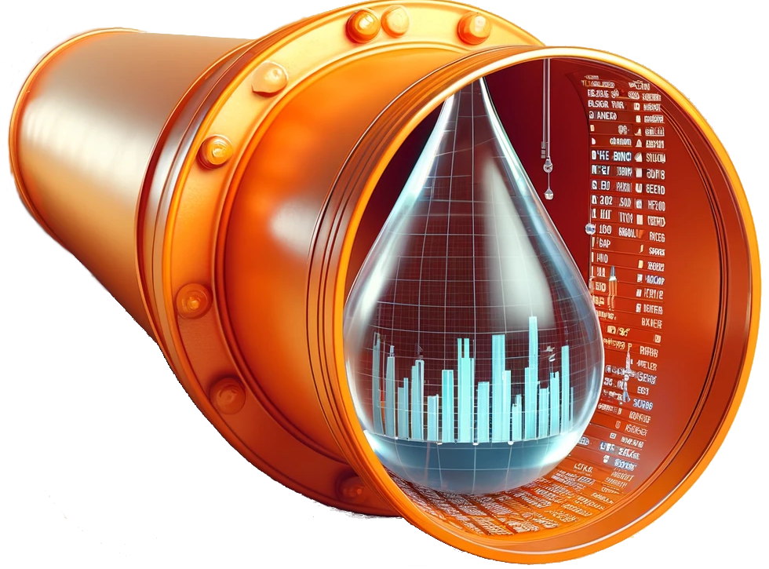

<!-- README.md is generated from README.Rmd. Please edit that file -->
<!-- badges: start -->

[](https://github.com/rpahl/pipeflow/actions/workflows/test-coverage.yaml)
[](https://github.com/rpahl/pipeflow/actions/workflows/check-standard.yaml)
[](https://github.com/rpahl/pipeflow/actions/workflows/lint.yaml)

<!-- badges: end -->

# pipeflow 

`pipeflow` provides an *easy* and yet *powerful* framework for composing
and running data processing pipelines. Whether you’re working with
scientific computations, machine learning (AI), or statistical
reporting, pipeflow can be used in any of these scenarios ranging from
small exploratory analyses up to large and complex production pipelines.

Since a `pipeflow` pipeline basically conists of a sequence of R
functions and can be used interactively, it is very easy to learn for
typical R users. At the same time, it provides a lot of features that
are useful for more advanced users, such as the ability to dynamically
create analysis branches or to let pipelines modify themselves at
runtime.

### Why to use `pipeflow`

- easy to learn
- manages function (inter-)dependencies
- promotes standardized analysis workflows
- eases handling of complex analysis pipelines
- improves reproducibility and reusability of code
- eases error handling and debugging

### Key features

- *Application:* interactive in R console or programmatically
- *Function dependencies:* checked at definition time
- *Logging:* logs each pipeline step; logger can be customized
- *Parameter management:* view and modify all function parameters in one
  place
- *Pipeline composition:* modify, extend and combine existing pipelines
- *Pipeline execution:* skip steps that are already up to date (similar
  to `make`)
- *Pipeline visualization:* both tabular and graphical visualization of
  the pipeline

### Advanced features

- *Dynamic branching:* create branches by applying the same pipeline to
  multiple datasets
- *Dynamic programming:* let pipelines modify themselves at runtime

### Installation

``` r
# Install release version from CRAN
install.packages("pipeflow")

# Install development version from GitHub
devtools::install_github("rpahl/pipeflow")
```

### Usage

``` r
library(pipeflow)
```

### Getting Started

It is recommended to read the vignettes in the order they are listed
below:

- [Get started with
  pipeflow](https://rpahl.github.io/pipeflow/articles/get-started.html)
- [Modifying existing
  pipelines](https://rpahl.github.io/pipeflow/articles/modify-pipeline.html)
- [Combining
  pipelines](https://rpahl.github.io/pipeflow/articles/combine-pipelines.html)
- [Collecting
  output](https://rpahl.github.io/pipeflow/articles/collect-output.html)

### Advanced topics

- [How to use pipeflow with split data
  sets](https://rpahl.github.io/pipeflow/articles/split-and-combine.html)
- [How pipelines can modify themselves at
  runtime](https://rpahl.github.io/pipeflow/articles/self-modify-pipeline.html)
