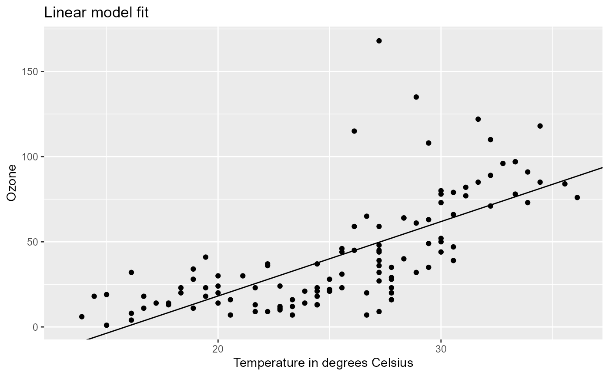
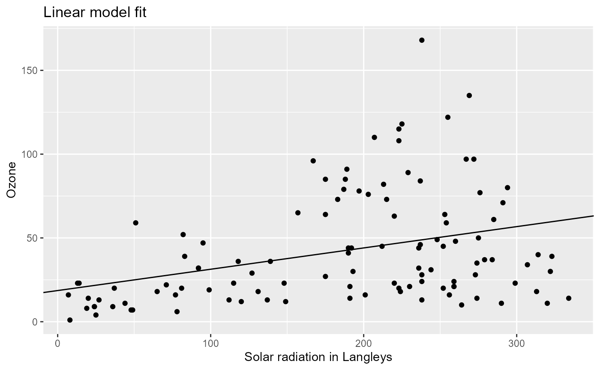
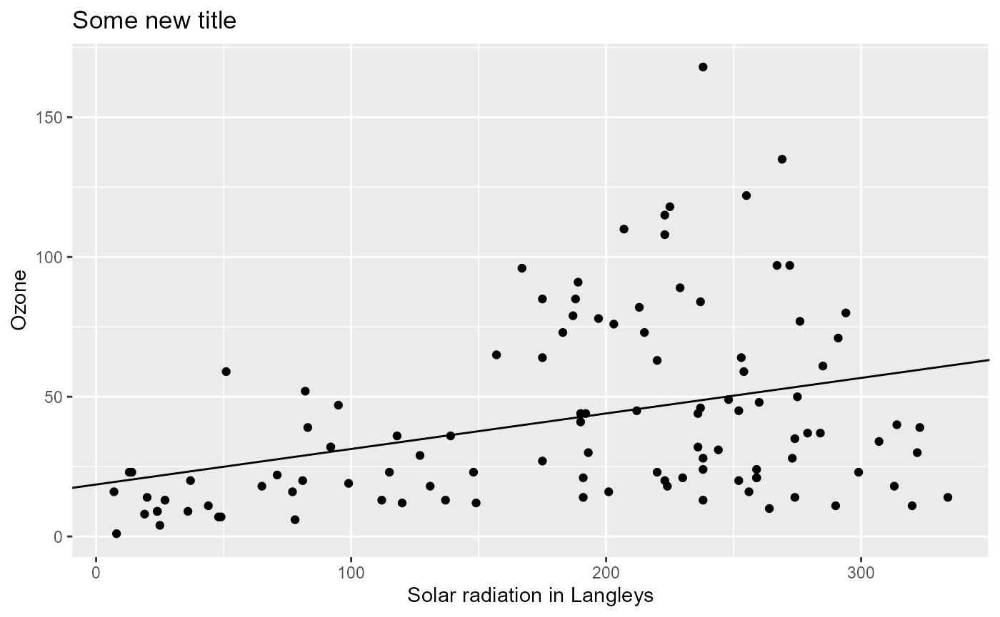
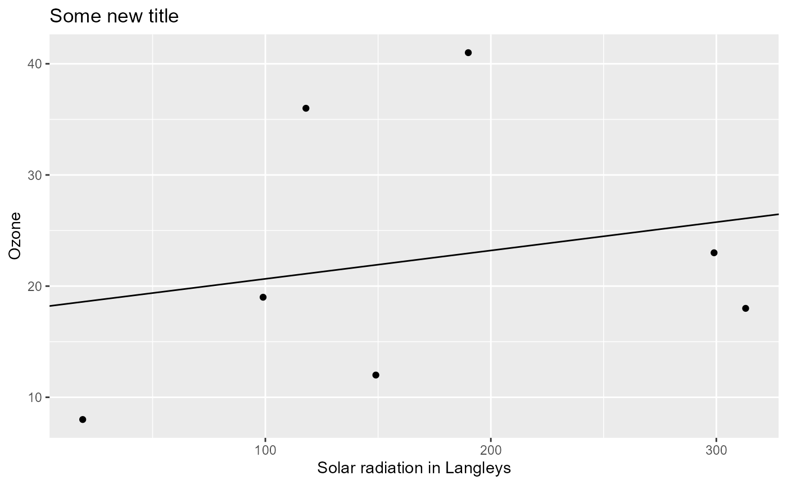

# Get started with pipeflow

## A simple example to get started

In this example, we’ll use base R’s airquality dataset.

``` r

head(airquality)
#   Ozone Solar.R Wind Temp Month Day
# 1    41     190  7.4   67     5   1
# 2    36     118  8.0   72     5   2
# 3    12     149 12.6   74     5   3
# 4    18     313 11.5   62     5   4
# 5    NA      NA 14.3   56     5   5
# 6    28      NA 14.9   66     5   6
```

Our goal is to create an analysis pipeline that performs the following
steps:

- add new data column `Temp.Celsius` containing the temperature in
  degrees Celsius
- fit a linear model to the data
- plot the data and the model fit.

In the following, we’ll show how to define and run the pipeline, how to
inspect the output of specific steps, and finally how to re-run the
pipeline with different parameter settings, which is one of the selling
points of using such a pipeline.

### Pipeline building

For easier understanding, we go step by step. First, we create a new
pipeline with the name “my-pipeline” and add a `data` step that provides
the input dataset.

``` r

library(pipeflow)

pip <- pip_new("my-pip")

pip <- pip_add(pip,
    step = "data",
    fun = function(data = airquality) data
)
```

For each step to add, at minimum we specify the name of the step and a
function that defines what is computed in that step. Let’s take a first
look at the pipeline.

``` r

pip
# <pipeflow_pip> my-pip (1 step)
# ------------------------------
#    step depends    out state
# 1: data         [NULL]   new
```

Here, each step is represented by one row in the table as denoted in the
first column. The `depends` column lists the dependencies of a step,
which is empty for the `data` step since it does not depend on any other
step (more on dependencies later). The `out` column will eventually
contain the output of the step, which is currently `NULL` since we
haven’t run the pipeline yet, and the `state` column shows the current,
which initially is `new` for all steps.

Next, we add a step called `data_prep`, which consists of a function
that takes the output of the `data` step as its first argument, adds a
new column and returns the modified data as its output. To refer to the
output of an earlier pipeline step, we just write the name of the step
preceded with the tilde (~) operator, that is, `~data` in this case.

Since `pip_add` works “by reference”, we can add the step as follows:

``` r

pip |> pip_add(
    "data_prep",
    function(x = ~data) {
        replace(x, "Temp.Celsius", (x[, "Temp"] - 32) * 5 / 9)
    }
)
```

So, a second step called `data_prep` was added and it depends on the
`data` step as now visible in column `depends`.

Next, we want to add a step called `model_fit` that fits a linear model
to the data. The function takes the output of the `data_prep` and
defines a parameter `xVar`, which is used to specify the variable that
is used as predictor in the linear model.

``` r

pip |> pip_add(
    "model_fit",
    function(
        data = ~data_prep,
        xVar = "Temp.Celsius"
    ) {
        lm(paste("Ozone ~", xVar), data = data)
    }
)
pip
# <pipeflow_pip> my-pip (3 steps)
# -------------------------------
#         step   depends    out state
# 1:      data           [NULL]   new
# 2: data_prep      data [NULL]   new
# 3: model_fit data_prep [NULL]   new
```

Lastly, we add a step called `model_plot`, which plots the data and the
linear model fit. The function uses the output from both the `model_fit`
and `data_prep` step. It also defines the `xVar` parameter and a
parameter `title`, which is used as the title of the plot.

``` r

pip |> pip_add(
    "model_plot",
    function(
        model = ~model_fit,
        data = ~data_prep,
        xVar = "Temp.Celsius",
        xLab = "Temperature in degrees Celsius",
        title = "Linear model fit"
    ) {
        require(ggplot2, quietly = TRUE)
        coeffs <- coefficients(model)
        ggplot(data) +
            geom_point(aes(.data[[xVar]], .data[["Ozone"]])) +
            geom_abline(intercept = coeffs[1], slope = coeffs[2]) +
            labs(title = title, x = xLab)
    }
)
pip
# <pipeflow_pip> my-pip (4 steps)
# -------------------------------
#          step             depends    out state
# 1:       data                     [NULL]   new
# 2:  data_prep                data [NULL]   new
# 3:  model_fit           data_prep [NULL]   new
# 4: model_plot model_fit,data_prep [NULL]   new
```

In the last line, we see that the `model_plot` step depends on both the
`model_fit` and `data_prep` step.

In addition to the tabular output, {pipeflow} also provides a graphical
representation that is compatible with the `visNetwork` package. In
particular, the
[`pip_get_graph()`](https://github.com/rpahl/pipeflow/reference/pip_get_graph.md)
function returns a list of arguments that can be feed directly to
[`visNetwork::visNetwork()`](https://rdrr.io/pkg/visNetwork/man/visNetwork.html).

``` r

library(visNetwork)
do.call(visNetwork, args = pip_get_graph(pip)) |>
    visHierarchicalLayout(direction = "LR")
```

Here, the pipeline is visualized as a directed acyclic graph (DAG) where
the nodes represent the steps and the edges represent the dependencies.

### Pipeline integrity

A key feature of {pipeflow} is that the integrity of a pipeline is
verified at definition time. To see this, let’s try to add another step
that is referring to a non-existent step `foo` as its input.

``` r

pip |> pip_add(
    "another_step",
    function(data = ~foo) {
        data
    }
)
# Error:
# ! while adding step 'another_step' - cannot reference unknown steps: 'foo'
```

{pipeflow} immediately signals an error and the pipeline remains
unchanged.

``` r

pip
# <pipeflow_pip> my-pip (4 steps)
# -------------------------------
#          step             depends    out state
# 1:       data                     [NULL]   new
# 2:  data_prep                data [NULL]   new
# 3:  model_fit           data_prep [NULL]   new
# 4: model_plot model_fit,data_prep [NULL]   new
```

### Pipeline run and output

To run the pipeline, we simply call
[`pip_run()`](https://github.com/rpahl/pipeflow/reference/pip_run.md),
which produces the following output:

``` r

pip_run(pip)
# info [2026-06-07 15:34:19.791 UTC]: Start run of pipeflow_pip 'my-pip'
# info [2026-06-07 15:34:19.792 UTC]: Step 1/4 data
# info [2026-06-07 15:34:19.793 UTC]: Step 2/4 data_prep
# info [2026-06-07 15:34:19.795 UTC]: Step 3/4 model_fit
# info [2026-06-07 15:34:19.801 UTC]: Step 4/4 model_plot
# info [2026-06-07 15:34:20.244 UTC]: Finished run of pipeflow_pip 'my-pip'
```

Let’s inspect the pipeline again.

``` r

pip
# <pipeflow_pip> my-pip (4 steps)
# -------------------------------
#          step             depends                 out state
# 1:       data                     <data.frame[153x6]>  done
# 2:  data_prep                data <data.frame[153x7]>  done
# 3:  model_fit           data_prep            <lm[13]>  done
# 4: model_plot model_fit,data_prep   <ggplot2::ggplot>  done
```

We can see that the `state` of all steps have been changed from `new` to
`done`, which graphically is represented by the color change from blue
to green.

In addition, the output was added in the `out` column. To access a
specific entry of the pipeline, we just select the row (aka step) and
column of pipeline table via the `[[` operator. For example, to inspect
the `out`put of the `model_fit` and `model_plot` steps, we do:

``` r

pip[["model_fit", "out"]]
# 
# Call:
# lm(formula = paste("Ozone ~", xVar), data = data)
# 
# Coefficients:
#  (Intercept)  Temp.Celsius  
#      -69.277         4.372
```

``` r

pip[["model_plot", "out"]]
```



### Pipeline parameters

Even for a moderately complex analysis consisting of, say, 15 to 20
different functions, keeping track of all the different analysis
parameters can quickly get out of hand.

As we will see, with {pipeflow} this becomes much easier, since the
pipeline itself keeps track of all parameters and their values. Let’s
first inspect the parameters of the above defined pipeline using the
[`pip_get_params()`](https://github.com/rpahl/pipeflow/reference/pip_get_params.md)
function.

``` r

pip_get_params(pip) |> str()
# List of 4
#  $ data :'data.frame':    153 obs. of  6 variables:
#   ..$ Ozone  : int [1:153] 41 36 12 18 NA 28 23 19 8 NA ...
#   ..$ Solar.R: int [1:153] 190 118 149 313 NA NA 299 99 19 194 ...
#   ..$ Wind   : num [1:153] 7.4 8 12.6 11.5 14.3 14.9 8.6 13.8 20.1 8.6 ...
#   ..$ Temp   : int [1:153] 67 72 74 62 56 66 65 59 61 69 ...
#   ..$ Month  : int [1:153] 5 5 5 5 5 5 5 5 5 5 ...
#   ..$ Day    : int [1:153] 1 2 3 4 5 6 7 8 9 10 ...
#  $ xVar : chr "Temp.Celsius"
#  $ xLab : chr "Temperature in degrees Celsius"
#  $ title: chr "Linear model fit"
```

It returns a list of all *independent* parameters (here `data`, `xVar`,
and `title`). By *independent* we mean that these parameters don’t
depend on other steps (i.e. steps defined with the `~` operator). This
is important as you never want to mess with parameters defined in terms
of other steps.

Furthermore, each parameter is only listed once, even if it is used in
multiple steps[^1]. To change any independent parameter, we simply call
[`pip_set_params()`](https://github.com/rpahl/pipeflow/reference/pip_set_params.md):

``` r

pip |>
    pip_set_params(list(xVar = "Solar.R", xLab = "Solar radiation in Langleys"))

pip_get_params(pip) |> str()
# List of 4
#  $ data :'data.frame':    153 obs. of  6 variables:
#   ..$ Ozone  : int [1:153] 41 36 12 18 NA 28 23 19 8 NA ...
#   ..$ Solar.R: int [1:153] 190 118 149 313 NA NA 299 99 19 194 ...
#   ..$ Wind   : num [1:153] 7.4 8 12.6 11.5 14.3 14.9 8.6 13.8 20.1 8.6 ...
#   ..$ Temp   : int [1:153] 67 72 74 62 56 66 65 59 61 69 ...
#   ..$ Month  : int [1:153] 5 5 5 5 5 5 5 5 5 5 ...
#   ..$ Day    : int [1:153] 1 2 3 4 5 6 7 8 9 10 ...
#  $ xVar : chr "Solar.R"
#  $ xLab : chr "Solar radiation in Langleys"
#  $ title: chr "Linear model fit"
```

{pipeflow} automatically propagates the parameter change to all steps
that use the respective parameter. In addition, it will recognize which
steps are affected by the parameter change and mark them as `outdated`.

``` r

pip
# <pipeflow_pip> my-pip (4 steps)
# -------------------------------
#          step             depends                 out    state
# 1:       data                     <data.frame[153x6]>     done
# 2:  data_prep                data <data.frame[153x7]>     done
# 3:  model_fit           data_prep            <lm[13]> outdated
# 4: model_plot model_fit,data_prep   <ggplot2::ggplot> outdated
```

We can see that the `model_fit` and `model_plot` steps are now in state
`outdated` (graphically indicated by the orange color). To update the
results, we just run the pipeline again.

``` r

pip_run(pip)
# info [2026-06-07 15:34:21.320 UTC]: Start run of pipeflow_pip 'my-pip'
# info [2026-06-07 15:34:21.320 UTC]: Step 1/4 data - skipping done step
# info [2026-06-07 15:34:21.321 UTC]: Step 2/4 data_prep - skipping done step
# info [2026-06-07 15:34:21.321 UTC]: Step 3/4 model_fit
# info [2026-06-07 15:34:21.324 UTC]: Step 4/4 model_plot
# info [2026-06-07 15:34:21.338 UTC]: Finished run of pipeflow_pip 'my-pip'
```

The outdated steps were re-run as expected and the output was updated
accordingly now showing the new x-variable `Solar.R`.

``` r

pip[["model_plot", "out"]]
```



A closer look at the run log shows that the pipeline skipped the first
two steps and ran only the steps that were outdated, which basically can
be thought of caching or mimicking the behavior of `make` in software
development. That is, {pipeflow} always keeps track of which steps are
outdated and only re-runs those steps and their downstream dependencies,
which can be a huge time saver for larger pipelines[^2].

Let’s visit some more examples of parameter changes and their effects on
the pipeline. To just change the title of the plot, only the
`model_plot` step needs to be rerun.

``` r

pip |> pip_set_params(list(title = "Some new title"))
pip
# <pipeflow_pip> my-pip (4 steps)
# -------------------------------
#          step             depends                 out    state
# 1:       data                     <data.frame[153x6]>     done
# 2:  data_prep                data <data.frame[153x7]>     done
# 3:  model_fit           data_prep            <lm[13]>     done
# 4: model_plot model_fit,data_prep   <ggplot2::ggplot> outdated
```

``` r

pip_run(pip)
# info [2026-06-07 15:34:21.711 UTC]: Start run of pipeflow_pip 'my-pip'
# info [2026-06-07 15:34:21.711 UTC]: Step 1/4 data - skipping done step
# info [2026-06-07 15:34:21.711 UTC]: Step 2/4 data_prep - skipping done step
# info [2026-06-07 15:34:21.712 UTC]: Step 3/4 model_fit - skipping done step
# info [2026-06-07 15:34:21.712 UTC]: Step 4/4 model_plot
# info [2026-06-07 15:34:21.721 UTC]: Finished run of pipeflow_pip 'my-pip'
pip[["model_plot", "out"]]
```



Once we change the input data parameter from the `data` step, since all
other steps depend on it, we expect all steps to be rerun.

``` r

small_airquality <- airquality[1:10, ]
pip |> pip_set_params(list(data = small_airquality))
pip
# <pipeflow_pip> my-pip (4 steps)
# -------------------------------
#          step             depends                 out    state
# 1:       data                     <data.frame[153x6]> outdated
# 2:  data_prep                data <data.frame[153x7]> outdated
# 3:  model_fit           data_prep            <lm[13]> outdated
# 4: model_plot model_fit,data_prep   <ggplot2::ggplot> outdated
```

``` r

pip_run(pip)
# info [2026-06-07 15:34:22.030 UTC]: Start run of pipeflow_pip 'my-pip'
# info [2026-06-07 15:34:22.031 UTC]: Step 1/4 data
# info [2026-06-07 15:34:22.031 UTC]: Step 2/4 data_prep
# info [2026-06-07 15:34:22.035 UTC]: Step 3/4 model_fit
# info [2026-06-07 15:34:22.038 UTC]: Step 4/4 model_plot
# info [2026-06-07 15:34:22.051 UTC]: Finished run of pipeflow_pip 'my-pip'
pip[["model_plot", "out"]]
```



Last but not least let’s try to set parameters that don’t exist in the
pipeline, which mostly happens due to accidental misspells.

``` r

pip |> pip_set_params(list(titel = "misspelled variable name", foo = "my foo"))
# Warning in pip_set_params(pip, list(titel = "misspelled variable name", : Trying to set parameters
# not defined in the target: titel, foo
```

As you see, a warning is given to the user hinting at the respective
parameter names, which makes fixing any misspells straight-forward.

Next, let’s see how to [modify the
pipeline](https://github.com/rpahl/pipeflow/articles/v02-modify-pipeline.md).

[^1]: For example, the `xVar` parameter is used in both the `model_fit`
    and `model_plot` step

[^2]: Another use case is backend computation in interactive shiny
    applications, where users change parameters dynamically and want
    quick updates.
