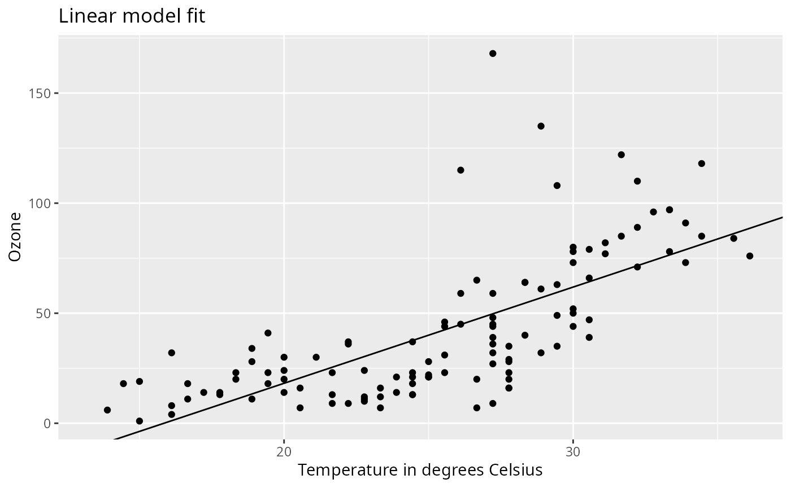
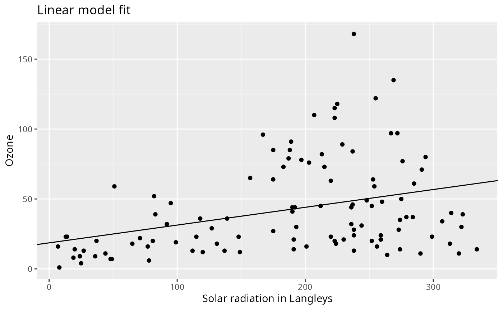
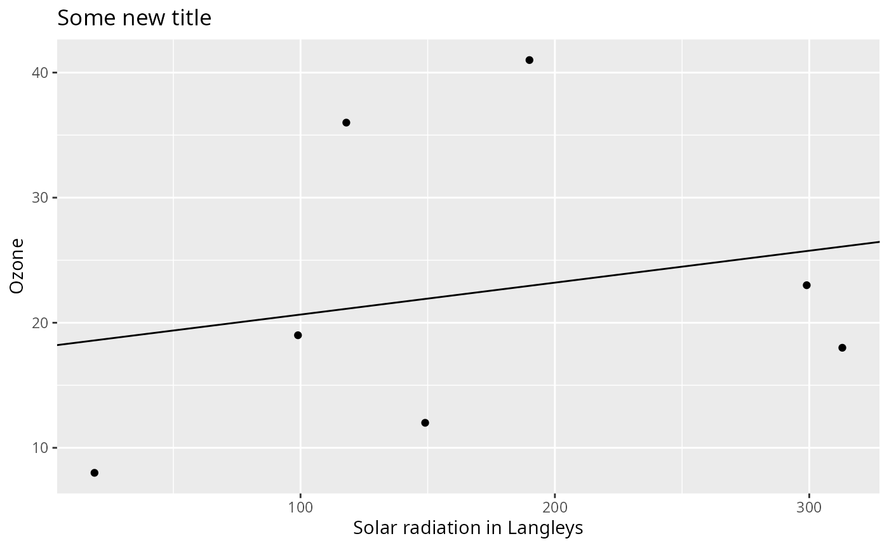

# Get started with pipeflow

## A simple example to get started

In this example, we’ll use base R’s airquality dataset.

``` r
head(airquality)
#   Ozone Solar.R Wind Temp Month Day
# 1    41     190  7.4   67     5   1
# 2    36     118  8.0   72     5   2
# 3    12     149 12.6   74     5   3
# 4    18     313 11.5   62     5   4
# 5    NA      NA 14.3   56     5   5
# 6    28      NA 14.9   66     5   6
```

Our goal is to create an analysis pipeline that performs the following
steps:

- add new data column `Temp.Celsius` containing the temperature in
  degrees Celsius
- fit a linear model to the data
- plot the data and the model fit.

In the following, we’ll show how to define and run the pipeline, how to
inspect the output of specific steps, and finally how to re-run the
pipeline with different parameter settings, which is one of the selling
points of using such a pipeline.

### Pipeline building

For easier understanding, we go step by step. First, we create a new
pipeline with the name “my-pipeline” and add a `data` step that provides
the input dataset.

``` r
library(pipeflow)

pip <- pip_new("my-pip")

pip <- pip_add(
    pip,
    step = "data",
    fun = function(data = airquality) data
)
```

For each step, at minimum we specify the name of the step (here
`step = "data`) and a function (`fun`) that defines what is computed in
that step. Let’s take a first look at the pipeline.

``` r
pip
# <pipeflow> my-pip (1 step)
# --------------------------
#    step params depends state
# 1: data   data           new
# --------------------------
# <ready> last run: never
```

Each step is represented by one row in the table, which currently shows
four columns:

- `step` the name of the step
- `params` the names of the function parameters
- `depends` the dependencies of a step (more on that below)
- `state` the state of each step, which initially is always set to `new`

Next, we want to add a step called `prep`, which prepares our original
data by adding the new column `"Temp.Celsius"`. This means, our `prep`
step will have to use the output of the `data` step. To refer to the
output of an earlier pipeline step, we just write its name preceded with
the tilde (~) operator, which in this case means `~data`.

Since `pip_add` works “by reference”, we can add the step as follows:

``` r
pip |> pip_add(
    "prep",
    function(df = ~data) {
        df[, "Temp.Celsius"] <- (df[, "Temp"] - 32) * 5 / 9
        df
    }
)
```

To reiterate: `function(df = ~data)` basically means that once this
function gets called `df` will contain whatever was produced last by the
`data` step.

So, a second step called `prep` was added and it depends on the `data`
step, which is also marked in the 2nd row in column `depends`.

``` r
pip
# <pipeflow> my-pip (2 steps)
# ---------------------------
#    step params depends state
# 1: data   data           new
# 2: prep     df    data   new
# ---------------------------
# <ready> last run: never
```

Next, we want to add a step called `fit` that fits a linear model to the
data. The function is using the `prep`ared data and defines a parameter
`xVar`, which determines the variable that is used as predictor in the
linear model.

``` r
pip |> pip_add(
    "fit",
    function(data = ~prep,
             xVar = "Temp.Celsius") {
        lm(paste("Ozone ~", xVar), data = data)
    }
)

pip
# <pipeflow> my-pip (3 steps)
# ---------------------------
#    step    params depends state
# 1: data      data           new
# 2: prep        df    data   new
# 3:  fit data,xVar    prep   new
# ---------------------------
# <ready> last run: never
```

Lastly, we add a step called `plot`, which plots the data and the linear
model fit. This function references both the `fit` and `prep` step. As
in the previous step, it defines the `xVar` parameter plus two more
plot-specific parameters `xLab` and `title`.

``` r
pip |> pip_add(
    "plot",
    function(model = ~fit,
             data = ~prep,
             xVar = "Temp.Celsius",
             xLab = "Temperature in degrees Celsius",
             title = "Linear model fit") {
        require(ggplot2, quietly = TRUE)
        coeffs <- coefficients(model)
        ggplot(data) +
            geom_point(aes(.data[[xVar]], .data[["Ozone"]])) +
            geom_abline(intercept = coeffs[1], slope = coeffs[2]) +
            labs(title = title, x = xLab)
    }
)
```

In the `depends` column of row `4:`, we see that the `plot` step depends
on both the `fit` and the `prep` step.

``` r
pip
# <pipeflow> my-pip (4 steps)
# ---------------------------
#    step                     params  depends state
# 1: data                       data            new
# 2: prep                         df     data   new
# 3:  fit                  data,xVar     prep   new
# 4: plot model,data,xVar,xLab,title fit,prep   new
# ---------------------------
# <ready> last run: never
```

In addition to the tabular output, {pipeflow} also provides a graphical
representation that is compatible with the `visNetwork` package. The
[`pip_graph()`](https://github.com/rpahl/pipeflow/reference/pip_graph.md)
function returns a list of arguments that can be feed directly to
[`visNetwork::visNetwork()`](https://rdrr.io/pkg/visNetwork/man/visNetwork.html).

``` r
library(visNetwork)
do.call(visNetwork, args = pip_graph(pip)) |>
    visHierarchicalLayout(direction = "LR")
```

Here, the pipeline is visualized as a directed acyclic graph (DAG) where
the nodes represent the steps and the edges represent the dependencies.

### Pipeline integrity

A key feature of {pipeflow} is that the integrity of a pipeline is
verified at definition time. To see this, let’s try to add another step
that referencing step that does not exist in the pipeline.

``` r
pip |> pip_add(
    "another_step",
    function(x = ~upsi) {
        x
    }
)
# Error:
# ! while adding step 'another_step' - cannot reference unknown steps: 'upsi'
```

{pipeflow} immediately signals an error and the pipeline remains
unchanged.

``` r
pip
# <pipeflow> my-pip (4 steps)
# ---------------------------
#    step                     params  depends state
# 1: data                       data            new
# 2: prep                         df     data   new
# 3:  fit                  data,xVar     prep   new
# 4: plot model,data,xVar,xLab,title fit,prep   new
# ---------------------------
# <ready> last run: never
```

### Pipeline run and output

To run the pipeline, we simply call
[`pip_run()`](https://github.com/rpahl/pipeflow/reference/pip_run.md),
which produces the following output:

``` r
pip_run(pip)
# info [2026-09-27 15:19:43.490 UTC]: Starting run of pipeflow 'my-pip'
# info [2026-09-27 15:19:43.490 UTC]: Step 1/4 data
# info [2026-09-27 15:19:43.491 UTC]: Step 2/4 prep
# info [2026-09-27 15:19:43.494 UTC]: Step 3/4 fit
# info [2026-09-27 15:19:43.514 UTC]: Step 4/4 plot
# info [2026-09-27 15:19:43.937 UTC]: Finished run of pipeflow 'my-pip'
```

Let’s inspect the pipeline again.

``` r
pip
# <pipeflow> my-pip (4 steps)
# ---------------------------
#    step                     params  depends state                 out
# 1: data                       data           done <data.frame[153x6]>
# 2: prep                         df     data  done <data.frame[153x7]>
# 3:  fit                  data,xVar     prep  done            <lm[13]>
# 4: plot model,data,xVar,xLab,title fit,prep  done   <ggplot2::ggplot>
# ---------------------------
# <ready> last run: 2026-09-27 17:19:43
```

We can see that the `state` of all steps have been changed from `new` to
`done`, which graphically is represented by the color change from blue
to green.

In addition, the output was added in a new `out` column[¹](#fn1). To
access a single value of the pipeline, we just select the row (aka step)
and a column of the pipeline table via the `[[` operator. For example,
to inspect the `out`put of the `fit` and `plot` steps, we do:

``` r
pip[["fit", "out"]]
# 
# Call:
# lm(formula = paste("Ozone ~", xVar), data = data)
# 
# Coefficients:
#  (Intercept)  Temp.Celsius  
#      -69.277         4.372
```

``` r
pip[["plot", "out"]]
```



### Pipeline parameters

Even for a moderately complex analysis consisting of, say, 15 to 20
different functions, keeping track of all the different analysis
parameters can quickly get out of hand.

As we will see, with {pipeflow} this becomes much easier, since the
pipeline itself keeps track of all parameters and their values. Let’s
first inspect the parameters of the above defined pipeline using the
[`pip_get_params()`](https://github.com/rpahl/pipeflow/reference/pip_set_params.md)
function.

``` r
pip_get_params(pip) |> str()
# List of 4
#  $ data :'data.frame':    153 obs. of  6 variables:
#   ..$ Ozone  : int [1:153] 41 36 12 18 NA 28 23 19 8 NA ...
#   ..$ Solar.R: int [1:153] 190 118 149 313 NA NA 299 99 19 194 ...
#   ..$ Wind   : num [1:153] 7.4 8 12.6 11.5 14.3 14.9 8.6 13.8 20.1 8.6 ...
#   ..$ Temp   : int [1:153] 67 72 74 62 56 66 65 59 61 69 ...
#   ..$ Month  : int [1:153] 5 5 5 5 5 5 5 5 5 5 ...
#   ..$ Day    : int [1:153] 1 2 3 4 5 6 7 8 9 10 ...
#  $ xVar : chr "Temp.Celsius"
#  $ xLab : chr "Temperature in degrees Celsius"
#  $ title: chr "Linear model fit"
```

It returns a list of all *unbound* parameters (here
`data, xVar, xLab, title`). By *unbound* we mean that the values of
these parameters don’t depend on other steps (i.e. parameters defined
with the `~` operator) and therefore can be adjusted freely.

Also note that each parameter is only listed once, even if it’s used in
multiple steps[²](#fn2). To change parameters, we simply call
[`pip_set_params()`](https://github.com/rpahl/pipeflow/reference/pip_set_params.md):

``` r
pip |>
    pip_set_params(list(xVar = "Solar.R", xLab = "Solar radiation in Langleys"))

pip_get_params(pip) |> str()
# List of 4
#  $ data :'data.frame':    153 obs. of  6 variables:
#   ..$ Ozone  : int [1:153] 41 36 12 18 NA 28 23 19 8 NA ...
#   ..$ Solar.R: int [1:153] 190 118 149 313 NA NA 299 99 19 194 ...
#   ..$ Wind   : num [1:153] 7.4 8 12.6 11.5 14.3 14.9 8.6 13.8 20.1 8.6 ...
#   ..$ Temp   : int [1:153] 67 72 74 62 56 66 65 59 61 69 ...
#   ..$ Month  : int [1:153] 5 5 5 5 5 5 5 5 5 5 ...
#   ..$ Day    : int [1:153] 1 2 3 4 5 6 7 8 9 10 ...
#  $ xVar : chr "Solar.R"
#  $ xLab : chr "Solar radiation in Langleys"
#  $ title: chr "Linear model fit"
```

{pipeflow} automatically propagates new parameter values to all steps
that use it. In addition, it will recognize which steps are affected by
the parameter change and mark them as `outdated` (see column `state`).

``` r
pip
# <pipeflow> my-pip (4 steps)
# ---------------------------
#    step                     params  depends    state                 out
# 1: data                       data              done <data.frame[153x6]>
# 2: prep                         df     data     done <data.frame[153x7]>
# 3:  fit                  data,xVar     prep outdated            <lm[13]>
# 4: plot model,data,xVar,xLab,title fit,prep outdated   <ggplot2::ggplot>
# ---------------------------
# <ready> last run: 2026-09-27 17:19:43
```

We can see that the `fit` and `plot` steps are now in state `outdated`,
because the `xVar` and `xLab` parameters were updated. To update the
results, we just run the pipeline again.

``` r
pip_run(pip)
# info [2026-09-27 15:19:44.759 UTC]: Starting run of pipeflow 'my-pip'
# info [2026-09-27 15:19:44.760 UTC]: Step 1/4 data - skipping done step
# info [2026-09-27 15:19:44.760 UTC]: Step 2/4 prep - skipping done step
# info [2026-09-27 15:19:44.760 UTC]: Step 3/4 fit
# info [2026-09-27 15:19:44.761 UTC]: Step 4/4 plot
# info [2026-09-27 15:19:44.769 UTC]: Finished run of pipeflow 'my-pip'
```

A closer look at the run log shows that the pipeline skipped the first
two steps and ran only the steps that were outdated, which basically can
be thought of caching or mimicking the behavior of `make` in software
development. That is, {pipeflow} always keeps track of the step states
and only re-runs those where its necessary. This can be a huge time
saver in larger pipelines[³](#fn3).

After the re-run, we can see that the output was updated accordingly now
showing the new x-variable `Solar.R`.

``` r
pip[["plot", "out"]]
```



Let’s visit some more examples of parameter changes and their effects on
the pipeline. To just change the title of the plot, only the `plot` step
needs to be rerun.

``` r
pip |> pip_set_params(list(title = "Some new title"))
pip
# <pipeflow> my-pip (4 steps)
# ---------------------------
#    step                     params  depends    state                 out
# 1: data                       data              done <data.frame[153x6]>
# 2: prep                         df     data     done <data.frame[153x7]>
# 3:  fit                  data,xVar     prep     done            <lm[13]>
# 4: plot model,data,xVar,xLab,title fit,prep outdated   <ggplot2::ggplot>
# ---------------------------
# <ready> last run: 2026-09-27 17:19:44
```

``` r
pip_run(pip)
# info [2026-09-27 15:19:45.148 UTC]: Starting run of pipeflow 'my-pip'
# info [2026-09-27 15:19:45.148 UTC]: Step 1/4 data - skipping done step
# info [2026-09-27 15:19:45.148 UTC]: Step 2/4 prep - skipping done step
# info [2026-09-27 15:19:45.148 UTC]: Step 3/4 fit - skipping done step
# info [2026-09-27 15:19:45.148 UTC]: Step 4/4 plot
# info [2026-09-27 15:19:45.160 UTC]: Finished run of pipeflow 'my-pip'
pip[["plot", "out"]]
```


Once we change the input data parameter from the `data` step, since all
other steps depend on it, we expect all steps to be rerun.

``` r
small_airquality <- airquality[1:10, ]
pip |> pip_set_params(list(data = small_airquality))
pip
# <pipeflow> my-pip (4 steps)
# ---------------------------
#    step                     params  depends    state                 out
# 1: data                       data          outdated <data.frame[153x6]>
# 2: prep                         df     data outdated <data.frame[153x7]>
# 3:  fit                  data,xVar     prep outdated            <lm[13]>
# 4: plot model,data,xVar,xLab,title fit,prep outdated   <ggplot2::ggplot>
# ---------------------------
# <ready> last run: 2026-09-27 17:19:45
```

``` r
pip_run(pip)
# info [2026-09-27 15:19:45.461 UTC]: Starting run of pipeflow 'my-pip'
# info [2026-09-27 15:19:45.461 UTC]: Step 1/4 data
# info [2026-09-27 15:19:45.462 UTC]: Step 2/4 prep
# info [2026-09-27 15:19:45.463 UTC]: Step 3/4 fit
# info [2026-09-27 15:19:45.464 UTC]: Step 4/4 plot
# info [2026-09-27 15:19:45.472 UTC]: Finished run of pipeflow 'my-pip'
pip[["plot", "out"]]
```



Last but not least let’s try to set parameters that don’t exist in the
pipeline, which mostly happens due to accidental misspells.

``` r
pip |> pip_set_params(list(titel = "misspelled variable name", foo = "my foo"))
# Warning in pip_set_params(pip, list(titel = "misspelled variable name", : Trying to set parameters
# not defined in the target: titel, foo
```

As you see, a warning is given to the user hinting at the respective
parameter names, which makes fixing any misspells straight-forward.

Next, let’s see how to [modify the
pipeline](https://github.com/rpahl/pipeflow/articles/v02-modify-pipeline.md).

------------------------------------------------------------------------

1.  Technically, the `out` column was there all the time but {pipeflow}
    just did not display it while it was still empty.

2.  For example, the `xVar` parameter is used in both the `fit` and
    `plot` step

3.  Another use case is backend computation in interactive shiny
    applications, where users change parameters dynamically and want
    quick updates.
