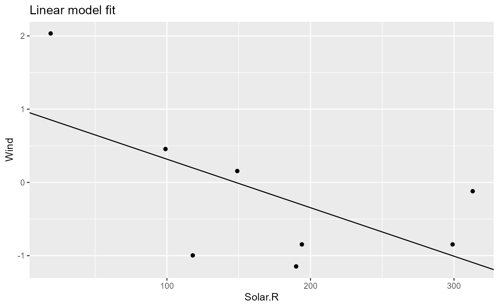

# Modifying existing pipelines

### Existing pipeline

Let’s start where we left off in the [Get started with
pipeflow](https://github.com/rpahl/pipeflow/articles/v01-get-started.md)
vignette, that is, we have the following pipeline

``` r

pip
# <pipeflow_pip> my-pip (4 steps)
# -------------------------------
#          step             depends                out state
# 1:       data                     <data.frame[10x6]>  done
# 2:  data_prep                data <data.frame[10x7]>  done
# 3:  model_fit           data_prep           <lm[13]>  done
# 4: model_plot model_fit,data_prep  <ggplot2::ggplot>  done
```

with the following set data

``` r

pip_get_params(pip)[["data"]] |> head(3)
#   Ozone Solar.R Wind Temp Month Day
# 1    41     190  7.4   67     5   1
# 2    36     118  8.0   72     5   2
# 3    12     149 12.6   74     5   3
```

### Insert new step

Let’s say we want to insert a new step after the `data_prep` step that
standardizes the y-variable. To do this, we use
[`pip_add()`](https://github.com/rpahl/pipeflow/reference/pip_add.md)
with the `after` argument.

``` r

pip |> pip_add(
    "standardize",
    function(
        data = ~data_prep,
        yVar = "Ozone"
    ) {
        data[, yVar] <- scale(data[, yVar])
        data
    },
    after = "data_prep"
)
```

``` r

pip
# <pipeflow_pip> my-pip (5 steps)
# -------------------------------
#           step             depends                out state
# 1:        data                     <data.frame[10x6]>  done
# 2:   data_prep                data <data.frame[10x7]>  done
# 3: standardize           data_prep             [NULL]   new
# 4:   model_fit           data_prep           <lm[13]>  done
# 5:  model_plot model_fit,data_prep  <ggplot2::ggplot>  done
```

``` r

library(visNetwork)
do.call(visNetwork, args = pip_get_graph(pip)) |>
    visHierarchicalLayout(direction = "LR", sortMethod = "directed")
```

The `standardize` step is now part of the pipeline, but so far it is not
used by any other step.

### Replace existing steps

Let’s revisit the function definition of the `model_fit` step

``` r

pip[["model_fit", "fun"]]
# function (data = ~data_prep, xVar = "Solar.R") 
# {
#     lm(paste("Ozone ~", xVar), data = data)
# }
```

To use the standardized data, we need to change the data dependency such
that it refers to the `standardize` step. Also instead of a fixed
y-variable in the model, let’s pass it as a parameter.

``` r

pip |> pip_replace(
    "model_fit",
    function(
        data = ~standardize,            # <- changed data reference
        xVar = "Temp.Celsius",
        yVar = "Ozone"                  # <- new y-variable
    ) {
        lm(paste(yVar, "~", xVar), data = data)
    }
)
```

The `model_plot` step needs to be updated in a similar way.

``` r

pip |> pip_replace(
    "model_plot",
    function(
        model = ~model_fit,
        data = ~standardize,            # <- changed data reference
        xVar = "Temp.Celsius",
        yVar = "Ozone",                 # <- new y-variable
        title = "Linear model fit"
    ) {
        coeffs <- coefficients(model)
        ggplot(data) +
            geom_point(aes(.data[[xVar]], .data[[yVar]])) +
            geom_abline(intercept = coeffs[1], slope = coeffs[2]) +
            labs(title = title)
    }
)
```

The updated pipeline now looks as follows.

``` r

pip
# <pipeflow_pip> my-pip (5 steps)
# -------------------------------
#           step               depends                out state
# 1:        data                       <data.frame[10x6]>  done
# 2:   data_prep                  data <data.frame[10x7]>  done
# 3: standardize             data_prep             [NULL]   new
# 4:   model_fit           standardize             [NULL]   new
# 5:  model_plot model_fit,standardize             [NULL]   new
```

We see that the `model_fit` and `model_plot` steps now use (i.e., depend
on) the standardized data. Let’s re-run the pipeline and inspect the
output.

``` r

pip_set_params(pip, params = list(xVar = "Solar.R", yVar = "Wind"))
pip_run(pip)
# info [2026-06-20 19:19:41.357 UTC]: Start run of pipeflow_pip 'my-pip'
# info [2026-06-20 19:19:41.358 UTC]: Step 1/5 data - skipping done step
# info [2026-06-20 19:19:41.358 UTC]: Step 2/5 data_prep - skipping done step
# info [2026-06-20 19:19:41.358 UTC]: Step 3/5 standardize
# info [2026-06-20 19:19:41.360 UTC]: Step 4/5 model_fit
# info [2026-06-20 19:19:41.362 UTC]: Step 5/5 model_plot
# info [2026-06-20 19:19:41.372 UTC]: Finished run of pipeflow_pip 'my-pip'
```

``` r

pip[["model_fit", "out"]] |> coefficients()
#  (Intercept)      Solar.R 
#  0.979672739 -0.006625601
```

``` r

pip[["model_plot", "out"]]
```



### Removing steps

Let’s see the pipeline again.

``` r

pip
# <pipeflow_pip> my-pip (5 steps)
# -------------------------------
#           step               depends                out state
# 1:        data                       <data.frame[10x6]>  done
# 2:   data_prep                  data <data.frame[10x7]>  done
# 3: standardize             data_prep <data.frame[10x7]>  done
# 4:   model_fit           standardize           <lm[13]>  done
# 5:  model_plot model_fit,standardize  <ggplot2::ggplot>  done
```

When you are trying to remove a step, {pipeflow} by default checks if
the step is used by any other step, and raises an error if removing the
step would violate the integrity of the pipeline.

``` r

try(pip_remove(pip, "standardize"))
# Error in pip_remove(pip, "standardize") : 
#   cannot remove step 'standardize' because the following steps depend on it: 'model_fit', 'model_plot'
```

To enforce removing a step together with all its downstream
dependencies, you can use the `recursive` argument.

``` r

pip_remove(pip, "standardize", recursive = TRUE)
# Removing step 'standardize' and its downstream dependencies: 'model_fit', 'model_plot'
```

``` r

pip
# <pipeflow_pip> my-pip (2 steps)
# -------------------------------
#         step depends                out state
# 1:      data         <data.frame[10x6]>  done
# 2: data_prep    data <data.frame[10x7]>  done
```

Naturally, the last step never has any downstream dependencies, so it
can be removed without any issues.

``` r

last_step <- tail(pip[["step"]], 1)
pip_remove(pip, last_step)
```

``` r

pip
# <pipeflow_pip> my-pip (1 step)
# ------------------------------
#    step depends                out state
# 1: data         <data.frame[10x6]>  done
```

Replacing steps in a pipeline as shown in this vignette will allow to
re-use existing pipelines and adapt them programmatically to new
requirements. Another way of re-using pipelines is to combine them,
which is shown in the [Combining
pipelines](https://github.com/rpahl/pipeflow/articles/v03-combine-pipelines.md)
vignette.
