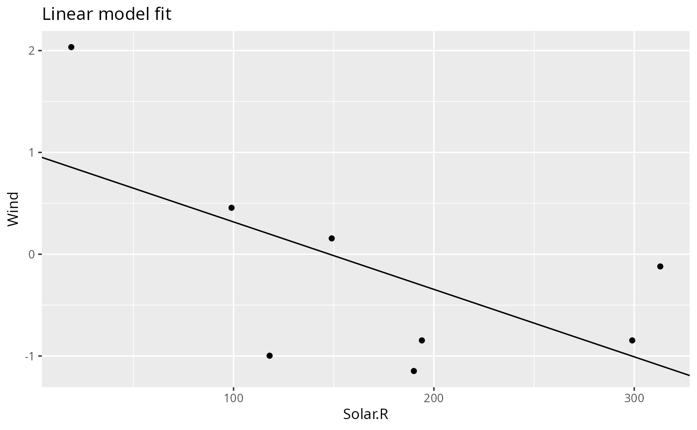

# Modify existing pipelines

### Existing pipeline

Let’s start where we left off in the [Get started with
pipeflow](https://github.com/rpahl/pipeflow/articles/v01-get-started.md)
vignette, that is, we have the following pipeline.

``` r
pip
# <pipeflow> my-pip (4 steps)
# ---------------------------
#    step                     params  depends state                out
# 1: data                       data           done <data.frame[10x6]>
# 2: prep                         df     data  done <data.frame[10x7]>
# 3:  fit                  data,xVar     prep  done           <lm[13]>
# 4: plot model,data,xVar,xLab,title fit,prep  done  <ggplot2::ggplot>
# ---------------------------
# <ready> last run: 2026-10-02 20:37:19
```

with the following set data

``` r
pip_get_params(pip)[["data"]] |> head(3)
#   Ozone Solar.R Wind Temp Month Day
# 1    41     190  7.4   67     5   1
# 2    36     118  8.0   72     5   2
# 3    12     149 12.6   74     5   3
```

### Insert new step

Let’s say we want to insert a new step after the `prep` step that
standardizes the y-variable. To do this, we use
[`pip_add()`](https://github.com/rpahl/pipeflow/reference/pip_add.md)
with the `after` argument.

``` r
pip |> pip_add(
    "standardize",
    function(data = ~prep,
             yVar = "Ozone") {
        data[, yVar] <- scale(data[, yVar])
        data
    },
    after = "prep"
)
```

``` r
pip
# <pipeflow> my-pip (5 steps)
# ---------------------------
#           step                     params  depends state                out
# 1:        data                       data           done <data.frame[10x6]>
# 2:        prep                         df     data  done <data.frame[10x7]>
# 3: standardize                  data,yVar     prep   new             [NULL]
# 4:         fit                  data,xVar     prep  done           <lm[13]>
# 5:        plot model,data,xVar,xLab,title fit,prep  done  <ggplot2::ggplot>
# ---------------------------
# <ready> last run: 2026-10-02 20:37:19
```

``` r
library(visNetwork)
do.call(visNetwork, args = pip_graph(pip)) |>
    visHierarchicalLayout(direction = "LR", sortMethod = "directed")
```

The `standardize` step is now part of the pipeline, but so far it is not
used by any other step.

### Replace existing steps

Let’s revisit the function definition of the `fit` step

``` r
pip[["fit", "fun"]]
# function (data = ~prep, xVar = "Temp.Celsius") 
# {
#     lm(paste("Ozone ~", xVar), data = data)
# }
# <environment: 0x5644e3705e30>
```

To use the standardized data, we need to change the data dependency such
that it refers to the `standardize` step. Also instead of a fixed
y-variable in the model, let’s pass it as a parameter.

``` r
pip |> pip_replace(
    "fit",
    function(data = ~standardize, # <- changed data reference
        xVar = "Temp.Celsius",
        yVar = "Ozone" # <- new y-variable
    ) {
        lm(paste(yVar, "~", xVar), data = data)
    }
)
```

The `plot` step needs to be updated in a similar way.

``` r
pip |> pip_replace(
    "plot",
    function(model = ~fit,
             data = ~standardize, # <- changed data reference
             xVar = "Temp.Celsius",
             yVar = "Ozone", # <- new y-variable
             title = "Linear model fit") {
        coeffs <- coefficients(model)
        ggplot(data) +
            geom_point(aes(.data[[xVar]], .data[[yVar]])) +
            geom_abline(intercept = coeffs[1], slope = coeffs[2]) +
            labs(title = title)
    }
)
```

The updated pipeline now looks as follows.

``` r
pip
# <pipeflow> my-pip (5 steps)
# ---------------------------
#           step                     params         depends state                out
# 1:        data                       data                  done <data.frame[10x6]>
# 2:        prep                         df            data  done <data.frame[10x7]>
# 3: standardize                  data,yVar            prep   new             [NULL]
# 4:         fit             data,xVar,yVar     standardize   new             [NULL]
# 5:        plot model,data,xVar,yVar,title fit,standardize   new             [NULL]
# ---------------------------
# <ready> last run: 2026-10-02 20:37:19
```

We see that the `fit` and `plot` steps now use (i.e., depend on) the
standardized data. Let’s re-run the pipeline and inspect the output.

``` r
pip_set_params(pip, params = list(xVar = "Solar.R", yVar = "Wind"))
pip_run(pip)
# info [2026-10-02 18:37:20.599 UTC]: Starting run of pipeflow 'my-pip'
# info [2026-10-02 18:37:20.599 UTC]: Step 1/5 data - skipping done step
# info [2026-10-02 18:37:20.599 UTC]: Step 2/5 prep - skipping done step
# info [2026-10-02 18:37:20.599 UTC]: Step 3/5 standardize
# info [2026-10-02 18:37:20.601 UTC]: Step 4/5 fit
# info [2026-10-02 18:37:20.602 UTC]: Step 5/5 plot
# info [2026-10-02 18:37:20.610 UTC]: Finished run of pipeflow 'my-pip'
```

``` r
pip[["fit", "out"]] |> coefficients()
#  (Intercept)      Solar.R 
#  0.979672739 -0.006625601
```

``` r
pip[["plot", "out"]]
```



### Removing steps

Let’s see the pipeline again.

``` r
pip
# <pipeflow> my-pip (5 steps)
# ---------------------------
#           step                     params         depends state                out
# 1:        data                       data                  done <data.frame[10x6]>
# 2:        prep                         df            data  done <data.frame[10x7]>
# 3: standardize                  data,yVar            prep  done <data.frame[10x7]>
# 4:         fit             data,xVar,yVar     standardize  done           <lm[13]>
# 5:        plot model,data,xVar,yVar,title fit,standardize  done  <ggplot2::ggplot>
# ---------------------------
# <ready> last run: 2026-10-02 20:37:20
```

When you are trying to remove a step, {pipeflow} by default checks if
the step is used by any other step, and raises an error if removing the
step would violate the integrity of the pipeline

``` r
try(pip_remove(pip, "standardize"))
# Error in pip_remove(pip, "standardize") : 
#   cannot remove step 'standardize' because the following steps depend on it: 'fit', 'plot'
```

To enforce removing a step together with all its downstream
dependencies, you can use the `force` argument.

``` r
pip_remove(pip, "standardize", force = TRUE)
# Removing step 'standardize' and its downstream dependencies: 'fit', 'plot'
```

``` r
pip
# <pipeflow> my-pip (2 steps)
# ---------------------------
#    step params depends state                out
# 1: data   data          done <data.frame[10x6]>
# 2: prep     df    data  done <data.frame[10x7]>
# ---------------------------
# <ready> last run: 2026-10-02 20:37:20
```

Naturally, the last step never has any downstream dependencies, so it
can be removed without any issues.

``` r
last_step <- tail(pip[["step"]], 1)
pip_remove(pip, last_step)
```

``` r
pip
# <pipeflow> my-pip (1 step)
# --------------------------
#    step params depends state                out
# 1: data   data          done <data.frame[10x6]>
# --------------------------
# <ready> last run: 2026-10-02 20:37:20
```

Replacing steps in a pipeline as shown in this vignette will allow to
re-use existing pipelines and adapt them programmatically to new
requirements. Another way of re-using pipelines is to combine them,
which is shown in the [Combine
pipelines](https://github.com/rpahl/pipeflow/articles/v03a-combine-pipelines.md)
vignette.
