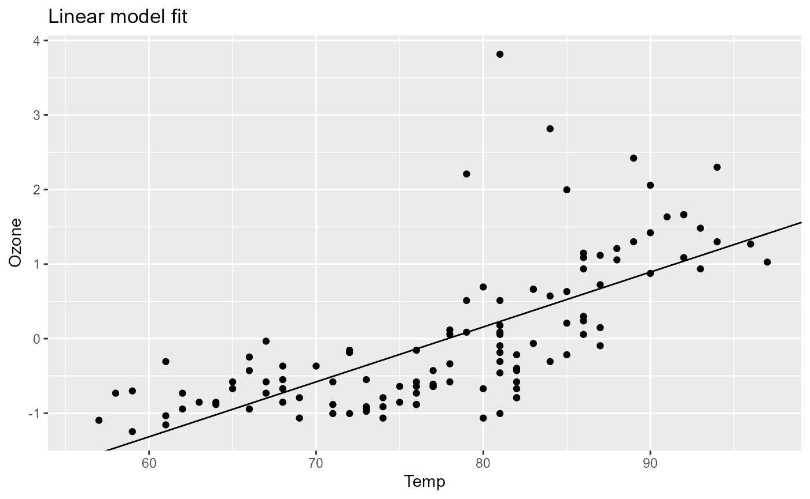

# Combining pipelines

The possibility to combine pipelines basically allows to modularize the
pipeline creation process. This is especially useful when you have a set
of pipelines that are used in different contexts and you want to avoid
code duplication.

### Two pipelines

Let’s define one pipeline that is used for data preprocessing and one
that does the modeling.

Data preprocessing pipeline:

``` r

library(pipeflow)

pip1 <- pip_new("preprocessing") |>
    pip_add(
        "data",
        function(data = airquality) data
    ) |>
    pip_add(
        "data_prep",
        function(data = ~data) {
            replace(data, "Temp.Celsius", (data[, "Temp"] - 32) * 5 / 9)
        }
    ) |>
    pip_add(
        "standardize",
        function(
            data = ~data_prep,
            yVar = "Ozone"
        ) {
            data[, yVar] <- scale(data[, yVar])
            data
        }
    )
```

``` r

pip1
# <pipeflow_pip> preprocessing (3 steps)
# --------------------------------------
#           step   depends    out state
# 1:        data           [NULL]   new
# 2:   data_prep      data [NULL]   new
# 3: standardize data_prep [NULL]   new
```

Modelling pipeline:

``` r

pip2 <- pip_new("modeling") |>
    pip_add(
        "data",
        function(data = airquality) data
    ) |>
    pip_add(
        "fit",
        function(
            data = ~data,
            xVar = "Temp",
            yVar = "Ozone"
        ) {
            lm(paste(yVar, "~", xVar), data = data)
        }
    ) |>
    pip_add(
        "plot",
        function(
            model = ~fit,
            data = ~data,
            xVar = "Temp",
            yVar = "Ozone",
            title = "Linear model fit"
        ) {
            require(ggplot2, quietly = TRUE)
            coeffs <- coefficients(model)
            ggplot(data) +
                geom_point(aes(.data[[xVar]], .data[[yVar]])) +
                geom_abline(intercept = coeffs[1], slope = coeffs[2]) +
                labs(title = title)
        }
    )
```

``` r

pip2
# <pipeflow_pip> modeling (3 steps)
# ---------------------------------
#    step  depends    out state
# 1: data          [NULL]   new
# 2:  fit     data [NULL]   new
# 3: plot fit,data [NULL]   new
```

### Combined pipeline

Next we combine the two pipelines using
[`pip_bind()`](https://github.com/rpahl/pipeflow/reference/pip_bind.md).

``` r

pip <- pip_bind(pip1, pip2)

pip
# <pipeflow_pip> preprocessing-modeling (6 steps)
# -----------------------------------------------
#           step       group   depends    out state
# 1:        data        data           [NULL]   new
# 2:   data_prep   data_prep      data [NULL]   new
# 3: standardize standardize data_prep [NULL]   new
# 4:       data2        data           [NULL]   new
# 5:         fit         fit     data2 [NULL]   new
# 6:        plot        plot fit,data2 [NULL]   new
```

First of all, note that the `data` step of the second pipeline has been
renamed automatically to avoid name clashes. In particular, the first
step of the second pipeline has been renamed from `data` to `data2`
(line 4 in the `step` column) and likewise the data-dependencies of the
second pipeline have been updated (see lines 5-6 in the `depends`
column).

That is, when binding two pipelines, {pipeflow} ensures that the step
names remain unique in the resulting combined pipeline and therefore
automatically renames duplicated step names if necessary.

Now, as can be also seen from the graphical representation of the
pipeline,

``` r

library(visNetwork)
do.call(visNetwork, args = pip_get_graph(pip)) |>
    visHierarchicalLayout(direction = "LR")
```

the two pipelines are not yet connected. To make actual use of the
combined pipeline, we have to use the output of the first pipeline as
input of the second pipeline, that is, we want to use the output of the
`standardize` step as the data parameter input in the `data2` step. To
achieve this, we apply the `replace` function as described earlier in
the vignette [modify the
pipeline](https://github.com/rpahl/pipeflow/articles/v02-modify-pipeline.md):

``` r

pip |> pip_replace("data2", function(data = ~standardize) data)

pip
# <pipeflow_pip> preprocessing-modeling (6 steps)
# -----------------------------------------------
#           step     depends    out    state
# 1:        data             [NULL]      new
# 2:   data_prep        data [NULL]      new
# 3: standardize   data_prep [NULL]      new
# 4:       data2 standardize [NULL]      new
# 5:         fit       data2 [NULL] outdated
# 6:        plot   fit,data2 [NULL] outdated
```

#### Relative indexing

Since the name of the re-routed step might not always be known[^1], the
{pipeflow} package also provides a relative position indexing mechanism,
which allows to rewrite the above command as follows:

``` r

pip |> pip_replace("data2", function(data = ~ -1) data)

pip
# <pipeflow_pip> preprocessing-modeling (6 steps)
# -----------------------------------------------
#           step     depends    out    state
# 1:        data             [NULL]      new
# 2:   data_prep        data [NULL]      new
# 3: standardize   data_prep [NULL]      new
# 4:       data2 standardize [NULL]      new
# 5:         fit       data2 [NULL] outdated
# 6:        plot   fit,data2 [NULL] outdated
```

Generally speaking, the relative indexing mechanism allows to refer to
steps positioned above the current step. The index `~-1` can be
interpreted as “go one step back”, `~-2` as “go two steps back”, and so
on.

### Combined pipeline results

Let’s now run the combined pipeline and inspect the plot.

``` r

pip_run(pip)
# info [2026-06-13 15:09:14.367 UTC]: Start run of pipeflow_pip 'preprocessing-modeling'
# info [2026-06-13 15:09:14.368 UTC]: Step 1/6 data
# info [2026-06-13 15:09:14.369 UTC]: Step 2/6 data_prep
# info [2026-06-13 15:09:14.371 UTC]: Step 3/6 standardize
# info [2026-06-13 15:09:14.372 UTC]: Step 4/6 data2
# info [2026-06-13 15:09:14.374 UTC]: Step 5/6 fit
# info [2026-06-13 15:09:14.377 UTC]: Step 6/6 plot
# info [2026-06-13 15:09:15.109 UTC]: Finished run of pipeflow_pip 'preprocessing-modeling'
```

``` r

pip[["plot", "out"]]
# Warning: Removed 37 rows containing missing values or values outside the scale range
# (`geom_point()`).
```


As we can see, the plot shows the linear model fit of the standardized
data. We can now go ahead and for example change the x-variable of the
model and rerun the pipeline.

``` r

pip_set_params(pip, params = list(xVar = "Temp.Celsius"))
```

``` r

pip_run(pip)
# info [2026-06-13 15:09:15.963 UTC]: Start run of pipeflow_pip 'preprocessing-modeling'
# info [2026-06-13 15:09:15.963 UTC]: Step 1/6 data - skipping done step
# info [2026-06-13 15:09:15.964 UTC]: Step 2/6 data_prep - skipping done step
# info [2026-06-13 15:09:15.964 UTC]: Step 3/6 standardize - skipping done step
# info [2026-06-13 15:09:15.964 UTC]: Step 4/6 data2 - skipping done step
# info [2026-06-13 15:09:15.964 UTC]: Step 5/6 fit
# info [2026-06-13 15:09:15.969 UTC]: Step 6/6 plot
# info [2026-06-13 15:09:15.990 UTC]: Finished run of pipeflow_pip 'preprocessing-modeling'
```

``` r

pip[["plot", "out"]]
# Warning: Removed 37 rows containing missing values or values outside the scale range
# (`geom_point()`).
```



### Step cherry-picking

Another way to re-use steps from other pipelines is by cherry-picking,
which can be done via `pip_add_from`, for example:

``` r

pip <- pip_new("cherry-picked-from-1-and-2") |>
    pip_add_from(pip1, "data") |>
    pip_add_from(pip1, "data_prep") |>
    pip_add_from(pip1, "standardize") |>
    pip_add_from(pip2, "fit") |>
    pip_add_from(pip2, "plot")

pip
# <pipeflow_pip> cherry-picked-from-1-and-2 (5 steps)
# ---------------------------------------------------
#           step   depends    out state
# 1:        data           [NULL]   new
# 2:   data_prep      data [NULL]   new
# 3: standardize data_prep [NULL]   new
# 4:         fit      data [NULL]   new
# 5:        plot  fit,data [NULL]   new
```

Note that here the cherry-pick approach is not all that useful, because
in contrast to the `pip_bind` command, which renames `data` to `data2`,
the cherry-picked `fit` and `plot` steps still refer to the initial
`data` step.

In other scenarios, however, this might be exactly what you want.

Generally, when creating these pipelines, there will be a lot of steps
calculating intermediate results and only a few steps contain the final
output we are interested in (see e.g. the `plot` output in the above
example). To see how {pipeflow} allows to conveniently tag, collect and
possibly group those final outputs, see the next vignette [Collecting
and filtering
output](https://github.com/rpahl/pipeflow/articles/v04-collect-output.md).

[^1]: A typical example would be appending several pipelines in a
    programmatic context.
