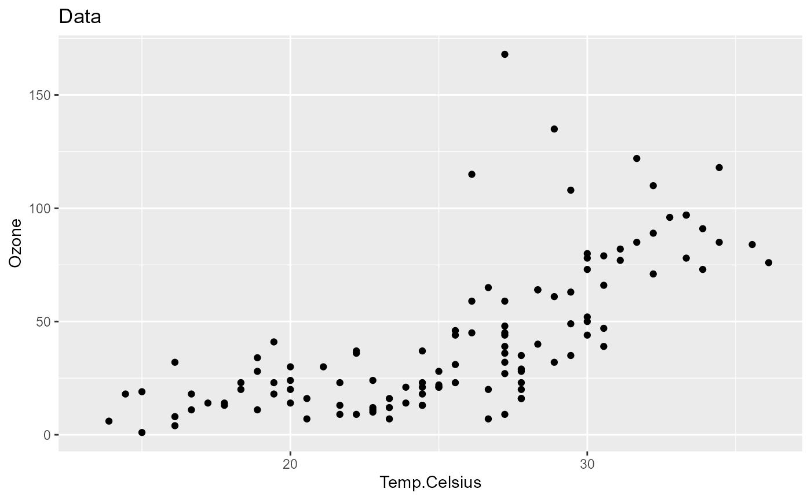
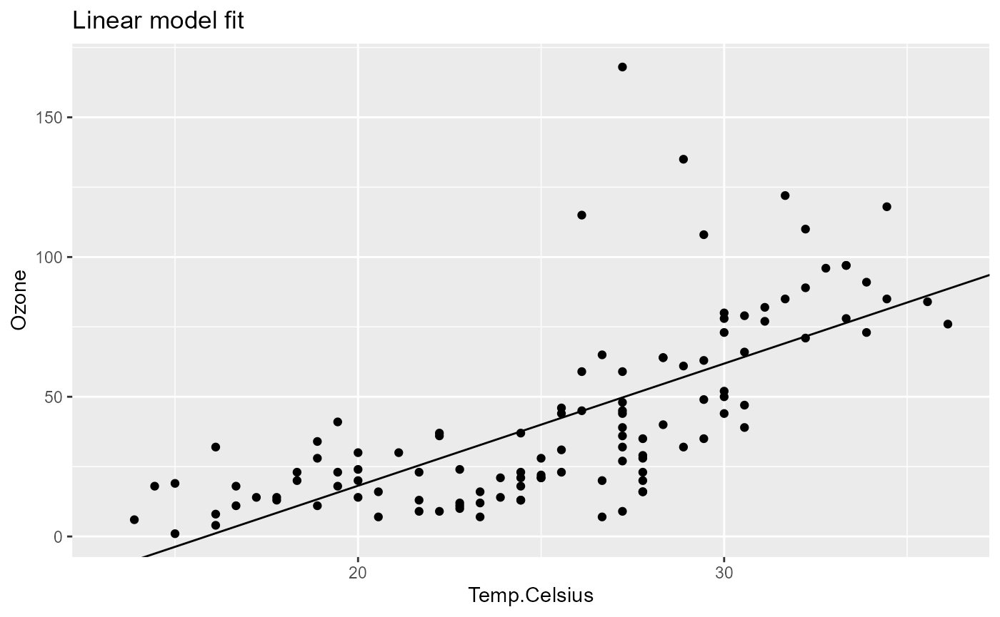
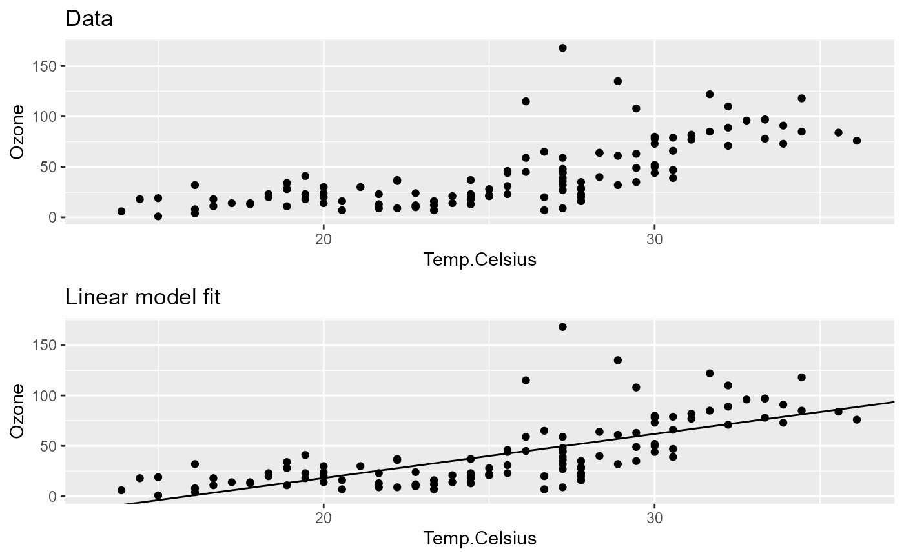

# Collecting and filtering output

Generally speaking, one should keep pipeline steps as simple as
possible, basically following the principle *“one step, one task”*.
Splitting up analysis steps into multiple functions naturally can be
hard to manage, but since {pipeflow} manages all function and parameter
dependencies for you, this is not a problem.

Following this principle, usually a lot of pipeline steps will carry
intermediate results and only a few steps will contain the final output
we are interested in. This vignette shows how to conveniently tag,
collect, and filter pipeline outputs using tags and views.

### Tagging steps

Tags let you label steps with meaningful keywords so you can later
filter the pipeline by topic, stage, or output type. Tags can be set
during pipeline creation or later using `pip_set_tags()`.

``` r

library(pipeflow)

pip <- pip_new("my-pip") |>
    pip_add(
        "data",
        function(data = airquality) data
    ) |>
    pip_add("data_prep",
        function(data = ~data) {
            replace(data, "Temp.Celsius", (data[, "Temp"] - 32) * 5 / 9)
        },
        tags = "data"                   # <-- set 'data' tag
    ) |>
    pip_add(
        "data_summary",
        function(
            data = ~data_prep,
            xVar = "Temp.Celsius",
            yVar = "Ozone"
        ) {
            format(summary(data[, c(xVar, yVar)])) |>
                as.data.frame(row.names = NA)
        },
        tags = c("data", "summary")     # <-- set 'data' and 'summary' tags
    ) |>
    pip_add(
        "data_plot",
        function(
            data = ~data_prep,
            xVar = "Temp.Celsius",
            yVar = "Ozone"
        ) {
            require(ggplot2, quietly = TRUE)
            ggplot(data) +
                geom_point(aes(.data[[xVar]], .data[[yVar]])) +
                labs(title = "Data")
        },
        tags = c("data", "plot")        # <-- set 'data' and 'plot' tags
    ) |>
    pip_add(
        "model_fit",
        function(
            data = ~data_prep,
            xVar = "Temp.Celsius",
            yVar = "Ozone"
        ) {
            lm(paste(yVar, "~", xVar), data = data)
        },
        tags = c("model", "fit")        # <-- set 'model' and 'fit' tags
    ) |>
    pip_add(
        "model_summary",
        function(fit = ~model_fit) {
            summary(fit) |>
                coefficients() |>
                as.data.frame()
        },
        tags = c("model", "summary")    # <-- set 'model' and 'summary' tags
    ) |>
    pip_add(
        "model_plot",
        function(
            model = ~model_fit,
            data_plot = ~data_plot,
            xVar = "Temp.Celsius",
            yVar = "Ozone"
        ) {
            coeffs <- coefficients(model)
            data_plot +
                geom_abline(intercept = coeffs[1], slope = coeffs[2]) +
                labs(title = "Linear model fit")
        },
        tags = c("model", "plot")       # <-- set 'model' and 'plot' tags
    )
```

We used two families of tags: `"data"`/`"model"` to distinguish the
topic, and `"summary"`/`"plot"`/`"fit"` for the output type. Whenever
tags are defined, they are shown in the pipeline overview:

``` r

pip
# <pipeflow_pip> my-pip (7 steps)
# -------------------------------
#             step             depends    out state          tags
# 1:          data                     [NULL]   new              
# 2:     data_prep                data [NULL]   new          data
# 3:  data_summary           data_prep [NULL]   new  data,summary
# 4:     data_plot           data_prep [NULL]   new     data,plot
# 5:     model_fit           data_prep [NULL]   new     model,fit
# 6: model_summary           model_fit [NULL]   new model,summary
# 7:    model_plot model_fit,data_plot [NULL]   new    model,plot
```

Before showing how to make use of the tags, let’s run the pipeline and
inspect the output individually as we did in the previous vignettes.

``` r

pip_run(pip)
# info [2026-06-13 17:23:19.012 UTC]: Start run of pipeflow_pip 'my-pip'
# info [2026-06-13 17:23:19.013 UTC]: Step 1/7 data
# info [2026-06-13 17:23:19.014 UTC]: Step 2/7 data_prep
# info [2026-06-13 17:23:19.017 UTC]: Step 3/7 data_summary
# info [2026-06-13 17:23:19.020 UTC]: Step 4/7 data_plot
# info [2026-06-13 17:23:19.678 UTC]: Step 5/7 model_fit
# info [2026-06-13 17:23:19.682 UTC]: Step 6/7 model_summary
# info [2026-06-13 17:23:19.685 UTC]: Step 7/7 model_plot
# info [2026-06-13 17:23:19.692 UTC]: Finished run of pipeflow_pip 'my-pip'

pip
# <pipeflow_pip> my-pip (7 steps)
# -------------------------------
#             step             depends                 out state          tags
# 1:          data                     <data.frame[153x6]>  done              
# 2:     data_prep                data <data.frame[153x7]>  done          data
# 3:  data_summary           data_prep   <data.frame[7x2]>  done  data,summary
# 4:     data_plot           data_prep   <ggplot2::ggplot>  done     data,plot
# 5:     model_fit           data_prep            <lm[13]>  done     model,fit
# 6: model_summary           model_fit   <data.frame[2x4]>  done model,summary
# 7:    model_plot model_fit,data_plot   <ggplot2::ggplot>  done    model,plot
```

``` r

pip[["data_plot", "out"]]
```



``` r

pip[["model_plot", "out"]]
```



### Flat output collection

[`pip_collect_out()`](https://github.com/rpahl/pipeflow/reference/pip_collect_out.md)
returns all step outputs as a flat named list.

``` r

out <- pip_collect_out(pip)

names(out)
# [1] "data"          "data_prep"     "data_summary"  "data_plot"     "model_fit"     "model_summary"
# [7] "model_plot"
```

### Filtered output using tags

To collect only the output of steps with a specific tag, we use
[`pip_view()`](https://github.com/rpahl/pipeflow/reference/pip_view.md),
which is {pipeflow}’s general-purpose function for filtering pipelines,
and then call
[`pip_collect_out()`](https://github.com/rpahl/pipeflow/reference/pip_collect_out.md)
on the filtered pipeline. To collect only the plots, for example, we can
filter by the `plot` tag.

``` r

pip_view(pip, tags = "plot")
# <pipeflow_view> my-pip view (2 of 7 steps)
# ------------------------------------------
#        step             depends               out state       tags
#   data_plot           data_prep <ggplot2::ggplot>  done  data,plot
#  model_plot model_fit,data_plot <ggplot2::ggplot>  done model,plot
```

``` r

pip |>
    pip_view(tags = "plot") |>
    pip_collect_out() |>
    gridExtra::grid.arrange(grobs = _, nrow = 2)
```



### Grouped output via views

Grouped output is achieved by composing
[`pip_view()`](https://github.com/rpahl/pipeflow/reference/pip_view.md)
with
[`pip_collect_out()`](https://github.com/rpahl/pipeflow/reference/pip_collect_out.md).
For example, to collect outputs grouped by topic (`"data"` and
`"model"`):

``` r

grouped <- list(
    data  = pip_view(pip, tags = "data")  |> pip_collect_out(),
    model = pip_view(pip, tags = "model") |> pip_collect_out()
)

names(grouped[["data"]])
# [1] "data_prep"    "data_summary" "data_plot"
names(grouped[["model"]])
# [1] "model_fit"     "model_summary" "model_plot"
```

### More on views

To make the example a bit more interesting, we first update some
parameters.

``` r

pip_set_params(pip, params = list(xVar = "Solar.R", yVar = "Wind"))

pip
# <pipeflow_pip> my-pip (7 steps)
# -------------------------------
#             step             depends                 out    state          tags
# 1:          data                     <data.frame[153x6]>     done              
# 2:     data_prep                data <data.frame[153x7]>     done          data
# 3:  data_summary           data_prep   <data.frame[7x2]> outdated  data,summary
# 4:     data_plot           data_prep   <ggplot2::ggplot> outdated     data,plot
# 5:     model_fit           data_prep            <lm[13]> outdated     model,fit
# 6: model_summary           model_fit   <data.frame[2x4]> outdated model,summary
# 7:    model_plot model_fit,data_plot   <ggplot2::ggplot> outdated    model,plot
```

{pipeflow} views provide a variety of filtering options. In the previous
section, the filtering was done based on tags, but you can also filter
based on other properties, for example, all steps that depend on the
`model_fit` step:

``` r

pip |> pip_view(filter = list(depends = "model_fit", state = "outdated"))
# <pipeflow_view> my-pip view (2 of 7 steps)
# ------------------------------------------
#           step             depends               out    state          tags
#  model_summary           model_fit <data.frame[2x4]> outdated model,summary
#     model_plot model_fit,data_plot <ggplot2::ggplot> outdated    model,plot
```

or using regex-based filtering, for example, to filter all outdated
steps starting with `data`:

``` r

pip |>
    pip_view(filter = list(step = "^data", state = "outdated"), fixed = FALSE)
# <pipeflow_view> my-pip view (2 of 7 steps)
# ------------------------------------------
#          step   depends               out    state         tags
#  data_summary data_prep <data.frame[7x2]> outdated data,summary
#     data_plot data_prep <ggplot2::ggplot> outdated    data,plot
```

Views can also be chained together:

``` r

v <- pip |> pip_view(filter = list(state = "outdated"))
v
# <pipeflow_view> my-pip view (5 of 7 steps)
# ------------------------------------------
#           step             depends               out    state          tags
#   data_summary           data_prep <data.frame[7x2]> outdated  data,summary
#      data_plot           data_prep <ggplot2::ggplot> outdated     data,plot
#      model_fit           data_prep          <lm[13]> outdated     model,fit
#  model_summary           model_fit <data.frame[2x4]> outdated model,summary
#     model_plot model_fit,data_plot <ggplot2::ggplot> outdated    model,plot

v2 <- v |> pip_view(tags = "plot")
v2
# <pipeflow_view> my-pip view view (2 of 7 steps)
# -----------------------------------------------
#        step             depends               out    state       tags
#   data_plot           data_prep <ggplot2::ggplot> outdated  data,plot
#  model_plot model_fit,data_plot <ggplot2::ggplot> outdated model,plot
```

Last but not least, views can be run as pipelines themselves, which
allows to conveniently re-run only the filtered steps, while {pipeflow}
ensures that any upstream dependencies are run first if needed.

``` r

v2 |> pip_run()
# info [2026-06-13 17:23:21.281 UTC]: Start run of pipeflow_view 'my-pip view view'
# info [2026-06-13 17:23:21.281 UTC]: Step 1/4 [upstream] data_prep - skipping done step
# info [2026-06-13 17:23:21.281 UTC]: Step 2/4 [view] data_plot
# info [2026-06-13 17:23:21.291 UTC]: Step 3/4 [upstream] model_fit
# info [2026-06-13 17:23:21.296 UTC]: Step 4/4 [view] model_plot
# info [2026-06-13 17:23:21.304 UTC]: Finished run of pipeflow_view 'my-pip view view'
```

Having a closer look at the run log, you’ll see which steps were re-run
as part of the `[view]` and which were re-run as `[upstream]`
dependencies. Since all views work by reference on the given pipeline,
the original pipeline is now up-to-date for the filtered steps.

``` r

pip
# <pipeflow_pip> my-pip (7 steps)
# -------------------------------
#             step             depends                 out    state          tags
# 1:          data                     <data.frame[153x6]>     done              
# 2:     data_prep                data <data.frame[153x7]>     done          data
# 3:  data_summary           data_prep   <data.frame[7x2]> outdated  data,summary
# 4:     data_plot           data_prep   <ggplot2::ggplot>     done     data,plot
# 5:     model_fit           data_prep            <lm[13]>     done     model,fit
# 6: model_summary           model_fit   <data.frame[2x4]> outdated model,summary
# 7:    model_plot model_fit,data_plot   <ggplot2::ggplot>     done    model,plot
```
