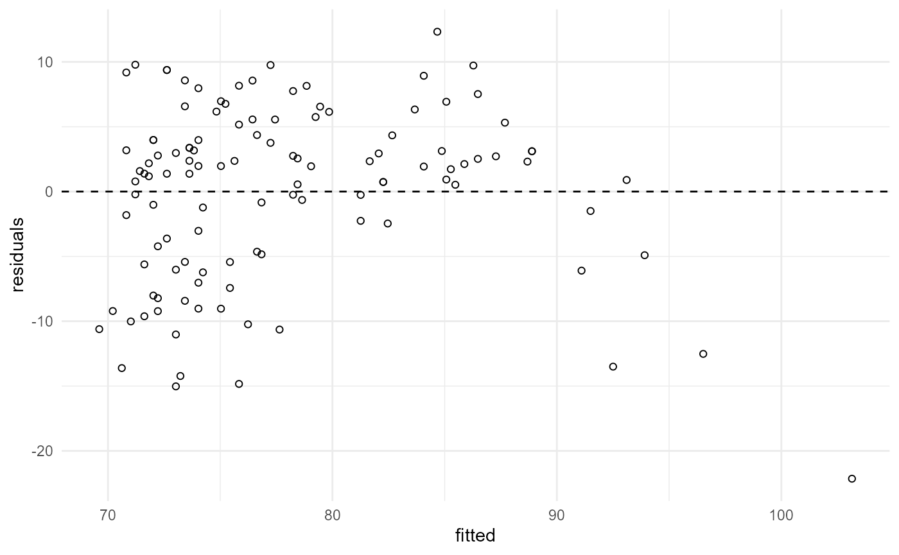
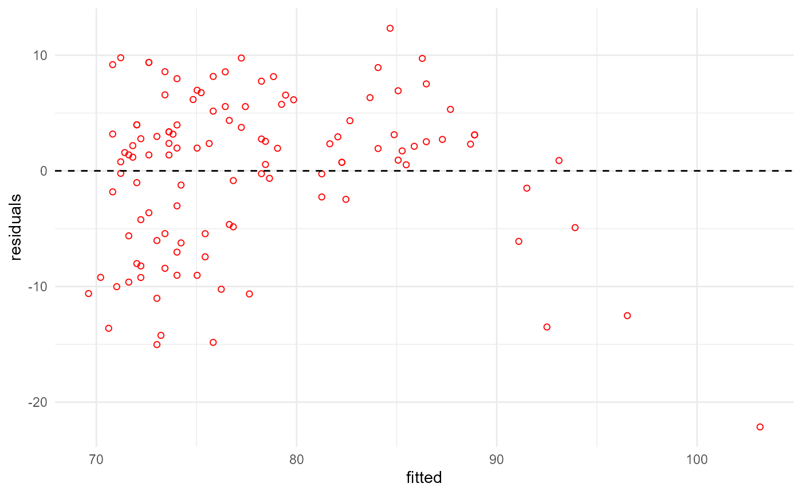
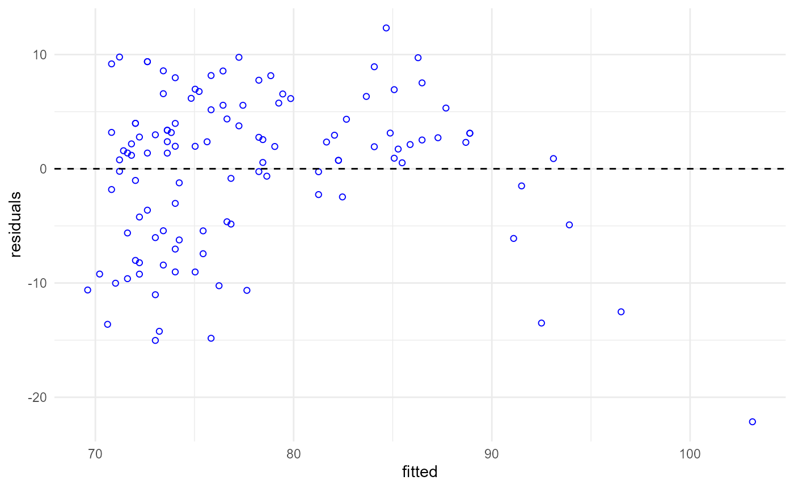

# Recursive self-modification

The {pipeflow} package aims to offer a lean and intuitive interface that
enables new users to get started quickly without having to learn a lot
of new concepts and functions.

At the same time, it was also designed to provide easy access to the
underlying data structures to allow advanced users to modify the
pipeline basically in any way they want. As such pipelines not only can
be modified before but also during execution, respectively. This opens
up a wide range of possibilities, for example, to change parameters
based on intermediate results or even to modify the pipeline structure
itself during a pipeline run. In the following, we will show some
examples of how this can be done.

### The pipeline object

Let’s first define a pipeline, which fits a linear model, checks it’s
residuals for normality using the Shapiro-Wilk test, and plots the
residuals.

``` r

library(pipeflow)

pip <- pip_new("my-pipeline") |>
    pip_add(
        "data",
        function(data = NULL) data
    ) |>
    pip_add(
        "fit",
        function(
            data = ~data,
            xVar = "x",
            yVar = "y"
        ) {
            lm(paste(yVar, "~", xVar), data = data)
        }
    ) |>
    pip_add(
        "residual_shapiro_p_value",
        function(fit = ~fit) {
            residuals <- residuals(fit)
            shapiro.test(residuals)$p.value
        }
    ) |>
    pip_add(
        "plot",
        function(
            fit = ~fit,
            pointColor = "black"
        ) {
            require(ggplot2, quietly = TRUE)
            data <- data.frame(
                fitted = predict(fit),
                residuals = residuals(fit)
            )

            ggplot(data, aes(x = fitted, y = residuals)) +
                geom_point(shape = 21, color = pointColor) +
                geom_hline(yintercept = 0, linetype = "dashed") +
                theme_minimal()
        }
    )
```

If you have followed the previous vignettes, you by now are used to the
pipeline overview.

``` r

pip
# <pipeflow_pip> my-pipeline (4 steps)
# ------------------------------------
#                        step depends    out state
# 1:                     data         [NULL]   new
# 2:                      fit    data [NULL]   new
# 3: residual_shapiro_p_value     fit [NULL]   new
# 4:                     plot     fit [NULL]   new
```

To inspect the internal structure, let’s start with the class.

``` r

class(pip)
# [1] "pipeflow_pip" "environment"
```

As we can see, the pipeline object is stored in an environment.

``` r

ls(pip)
# [1] "name"     "pipeline"
```

There is the “name” of the pipeline, which is just a character string.
The most interesting object is the “pipeline”, object, which under the
hood is a `data.table` object containing all the information about the
steps, their dependencies, meta information, and so on.

``` r

data.class(pip$pipeline)
# [1] "data.table"

pip$pipeline
#                        step                    group           fun    params
#                      <char>                   <char>        <list>    <list>
# 1:                     data                     data <function[1]> <list[1]>
# 2:                      fit                      fit <function[1]> <list[3]>
# 3: residual_shapiro_p_value residual_shapiro_p_value <function[1]> <list[1]>
# 4:                     plot                     plot <function[1]> <list[2]>
#                                 signature depends    out  state   tags                time locked
#                                    <char>  <list> <list> <char> <list>              <POSc> <lgcl>
# 1:                          (data = NULL)         [NULL]    new        2026-06-07 17:35:06  FALSE
# 2: (data = ~data, xVar = "x", yVar = "y")    data [NULL]    new        2026-06-07 17:35:06  FALSE
# 3:                           (fit = ~fit)     fit [NULL]    new        2026-06-07 17:35:06  FALSE
# 4:     (fit = ~fit, pointColor = "black")     fit [NULL]    new        2026-06-07 17:35:06  FALSE
#      exec .nodeId    .indeps
#    <char>   <int>     <list>
# 1:   auto       0       data
# 2:   auto       1  xVar,yVar
# 3:   auto       2           
# 4:   auto       3 pointColor
```

### Changing pipeline parameters at runtime

First, we set some data and parameters and run the pipeline as usual.

``` r

pip |> pip_set_params(list(data = airquality, xVar = "Ozone", yVar = "Temp"))

pip_run(pip)
# info [2026-06-07 15:35:07.206 UTC]: Start run of pipeflow_pip 'my-pipeline'
# info [2026-06-07 15:35:07.206 UTC]: Step 1/4 data
# info [2026-06-07 15:35:07.207 UTC]: Step 2/4 fit
# info [2026-06-07 15:35:07.211 UTC]: Step 3/4 residual_shapiro_p_value
# info [2026-06-07 15:35:07.213 UTC]: Step 4/4 plot
# info [2026-06-07 15:35:07.730 UTC]: Finished run of pipeflow_pip 'my-pipeline'

pip[["plot", "out"]]
```



Now let’s imagine, we want to change the color of the points in the plot
depending on the Shapiro-Wilk test result. The obvious way to do this
would be to change the `plot` step by passing the test result to the
`plot` step function and change the color there.

However, here we are interested in another way that would keep the
`plot` function unchanged. For example, we could run the pipeline a
second time as follows:

``` r

if (pip[["residual_shapiro_p_value", "out"]] < 0.05) {
    pip |>
        pip_set_params(list(pointColor = "red")) |>
        pip_run()
}
# info [2026-06-07 15:35:08.059 UTC]: Start run of pipeflow_pip 'my-pipeline'
# info [2026-06-07 15:35:08.060 UTC]: Step 1/4 data - skipping done step
# info [2026-06-07 15:35:08.060 UTC]: Step 2/4 fit - skipping done step
# info [2026-06-07 15:35:08.060 UTC]: Step 3/4 residual_shapiro_p_value - skipping done step
# info [2026-06-07 15:35:08.060 UTC]: Step 4/4 plot
# info [2026-06-07 15:35:08.118 UTC]: Finished run of pipeflow_pip 'my-pipeline'

pip[["plot", "out"]]
```



As was mentioned in another vignette, this solution is not ideal, as it
requires to run additional code around the pipeline. We rather want to
set the parameter from within the pipeline during execution.

Luckily, the pipeline by default assigns itself to the `.self` parameter
to potentially be used in any step functions. With this in mind, we
update the `residual_shapiro_p_value` step as follows:

``` r

pip |> pip_replace(
    "residual_shapiro_p_value",
    function(
        fit = ~fit,
        .self = NULL
    ) {
        residuals <- residuals(fit)
        p <- shapiro.test(residuals)$p.value

        if (p < 0.05) {
            .self |> pip_set_params(list(pointColor = "blue"))
        }

        p
    }
)
```

Now we just have to make sure to set the `.self` parameter.

``` r

pip_run(pip)
# info [2026-06-07 15:35:08.402 UTC]: Start run of pipeflow_pip 'my-pipeline'
# info [2026-06-07 15:35:08.403 UTC]: Step 1/4 data - skipping done step
# info [2026-06-07 15:35:08.403 UTC]: Step 2/4 fit - skipping done step
# info [2026-06-07 15:35:08.403 UTC]: Step 3/4 residual_shapiro_p_value
# info [2026-06-07 15:35:08.406 UTC]: Step 4/4 plot
# info [2026-06-07 15:35:08.459 UTC]: Finished run of pipeflow_pip 'my-pipeline'

pip[["plot", "out"]]
```



This simple “trick” opens up a wide range of possibilities for pipeline
modifications at runtime. As we will show in the next section, this is
not limited to changing parameters but can also be used to modify the
very own pipeline structure.

### Changing pipeline structure at runtime

Subsequently, the pipeline steps will be comprised only of very basic
functions in order to keep matters simple. The focus here is on the
pipeline structure and how it can be modified at runtime.

``` r

pip <- pip_new("my-pipeline") |>
    pip_add("init", function(xInit = 0) xInit) |>
    pip_add("f1", function(x = ~init) x + 1) |>
    pip_add("f2", function(x = ~f1) x + 2) |>
    pip_add("f3", function(x = ~f2) x + 3)
```

This pipeline just adds 1, 2, and 3 to the initial value, respectively.

``` r

pip_run(pip)
# info [2026-06-07 15:35:08.731 UTC]: Start run of pipeflow_pip 'my-pipeline'
# info [2026-06-07 15:35:08.732 UTC]: Step 1/4 init
# info [2026-06-07 15:35:08.732 UTC]: Step 2/4 f1
# info [2026-06-07 15:35:08.734 UTC]: Step 3/4 f2
# info [2026-06-07 15:35:08.735 UTC]: Step 4/4 f3
# info [2026-06-07 15:35:08.736 UTC]: Finished run of pipeflow_pip 'my-pipeline'

pip
# <pipeflow_pip> my-pipeline (4 steps)
# ------------------------------------
#    step depends out state
# 1: init           0  done
# 2:   f1    init   1  done
# 3:   f2      f1   3  done
# 4:   f3      f2   6  done
```

The `out` column in the table shows the output of each step. Now let’s
modify step `f2` that in turn will modify `f3` at runtime based on the
interim result passed into `f2`.

#### Modify steps

``` r

pip |> pip_replace(
    "f2",
    function(
        x = ~f1,
        .self = NULL
    ) {
        if (x > 10) {
            .self |> pip_replace("f3", function(x = ~f1) x * 3)
            return(x / 2)
        }
        x + 2
    }
)
```

Basically, step `f2` now checks if the input is greater than 10, and if
so, it replaces step `f3` with a new step now referencing `f1` that
multiplies the input passed from `f1` by 3 and returns half of the
input.

To see this, let’s try it with an input of 15.

``` r

pip |>
    pip_set_params(list(xInit = 15)) |>
    pip_run()
# info [2026-06-07 15:35:08.852 UTC]: Start run of pipeflow_pip 'my-pipeline'
# info [2026-06-07 15:35:08.852 UTC]: Step 1/4 init
# info [2026-06-07 15:35:08.854 UTC]: Step 2/4 f1
# info [2026-06-07 15:35:08.856 UTC]: Step 3/4 f2
# info [2026-06-07 15:35:08.860 UTC]: Step 4/4 f3
# info [2026-06-07 15:35:08.862 UTC]: Finished run of pipeflow_pip 'my-pipeline'

pip
# <pipeflow_pip> my-pipeline (4 steps)
# ------------------------------------
#    step depends out state
# 1: init          15  done
# 2:   f1    init  16  done
# 3:   f2      f1   8  done
# 4:   f3      f1  48  done
```

We see that both the output of the pipeline and the dependencies of the
last step have changed. Let’s confirm by inspecting the function of the
last step.

``` r

pip[["f3", "fun"]]
# function (x = ~f1) 
# x * 3
# <environment: 0x00000265b643ada0>
```

#### Insert and remove steps

For our last example, we get even more hacky an dinstead of just
replacing, we will go a bit further to insert and remove steps. The
pipeline definition is as follows:

``` r

pip <- pip_new("my-pipeline") |>
    pip_add("init", function(xInit = 0) xInit) |>
    pip_add("f1", function(x = ~init) x + 1) |>
    pip_add(
        "f2",
        function(
            x = ~f1,
            .self = NULL
        ) {
            if (x > 10) {
                .self |>
                    pip_add(
                        "f2a",
                        function(x = ~f1) x + 21,
                        after = "f1",
                    ) |>
                    pip_add(
                        "f2b",
                        function(x = ~f2a) x + 22,
                        after = "f2a"
                    ) |>
                    pip_replace(
                        "f3",
                        function(x = ~f2b) {
                            x + 30
                        }
                    ) |>
                    pip_remove("f2")
            }
            x + 2
        }
    ) |>
    pip_add("f3", function(x = ~f2) x + 3)
```

Basically, if the input is greater than 10, we insert two new steps
`f2a` and `f2b` after `f1`, remove `f2`, and replace `f3` with a new
step that adds 30 to the input. Let’s first run with the initial value
of 0 to see the original output.

``` r

pip_run(pip)
# info [2026-06-07 15:35:09.028 UTC]: Start run of pipeflow_pip 'my-pipeline'
# info [2026-06-07 15:35:09.028 UTC]: Step 1/4 init
# info [2026-06-07 15:35:09.029 UTC]: Step 2/4 f1
# info [2026-06-07 15:35:09.030 UTC]: Step 3/4 f2
# info [2026-06-07 15:35:09.032 UTC]: Step 4/4 f3
# info [2026-06-07 15:35:09.033 UTC]: Finished run of pipeflow_pip 'my-pipeline'

pip
# <pipeflow_pip> my-pipeline (4 steps)
# ------------------------------------
#    step depends out state
# 1: init           0  done
# 2:   f1    init   1  done
# 3:   f2      f1   3  done
# 4:   f3      f2   6  done
```

Next, we set the initial value to 11 to trigger the changes.

``` r

pip |>
    pip_set_params(list(xInit = 11)) |>
    pip_run()
# info [2026-06-07 15:35:09.091 UTC]: Start run of pipeflow_pip 'my-pipeline'
# info [2026-06-07 15:35:09.095 UTC]: Step 1/4 init
# info [2026-06-07 15:35:09.095 UTC]: Step 2/4 f1
# info [2026-06-07 15:35:09.097 UTC]: Step 3/4 f2
# info [2026-06-07 15:35:09.116 UTC]: Step 4/4 f3
# info [2026-06-07 15:35:09.117 UTC]: Finished run of pipeflow_pip 'my-pipeline'

pip
# <pipeflow_pip> my-pipeline (5 steps)
# ------------------------------------
#    step depends    out state
# 1: init             11  done
# 2:   f1    init     12  done
# 3:  f2a      f1 [NULL]   new
# 4:  f2b     f2a         done
# 5:   f3     f2b [NULL]   new
```

While the structure has changed as expected, some steps were not yet
run. In fact, since originally step `f3`came after `f2`, and in contrast
to what the log is showing, instead of step `f3`, actually the new step
`f2b` was run, albeit with x = NULL as input.

So to have the true results, we need to re-init the parameter and need
to re-run the pipeline.

``` r

pip |>
    pip_set_params(list(xInit = 11)) |>
    pip_run()
# info [2026-06-07 15:35:09.177 UTC]: Start run of pipeflow_pip 'my-pipeline'
# info [2026-06-07 15:35:09.177 UTC]: Step 1/5 init
# info [2026-06-07 15:35:09.177 UTC]: Step 2/5 f1
# info [2026-06-07 15:35:09.179 UTC]: Step 3/5 f2a
# info [2026-06-07 15:35:09.180 UTC]: Step 4/5 f2b
# info [2026-06-07 15:35:09.181 UTC]: Step 5/5 f3
# info [2026-06-07 15:35:09.182 UTC]: Finished run of pipeflow_pip 'my-pipeline'

pip
# <pipeflow_pip> my-pipeline (5 steps)
# ------------------------------------
#    step depends out state
# 1: init          11  done
# 2:   f1    init  12  done
# 3:  f2a      f1  33  done
# 4:  f2b     f2a  55  done
# 5:   f3     f2b  85  done
```

Now the output of all steps is as expected. If we want to use {pipeflow}
in production, obviously, having to re-run the pipeline and temporarily
showing a wrong log is not ideal. Luckily, {pipeflow} provides a
built-in solution for this.

First, we have to make sure that any step modifying the pipeline
structure returns the modified pipeline object itself, so let’s redefine
the pipeline as follows:

``` r

pip <- pip_new("my-pipeline") |>
    pip_add("init", function(xInit = 0) xInit) |>
    pip_add("f1", function(x = ~init) x + 1) |>
    pip_add(
        "f2",
        function(
            x = ~f1,
            .self = NULL
        ) {
            if (x > 10) {
                .self |>
                    pip_add(
                        "f2a",
                        function(x = ~f1) x + 21,
                        after = "f1",
                    ) |>
                    pip_add(
                        "f2b",
                        function(x = ~f2a) x + 22,
                        after = "f2a"
                    ) |>
                    pip_replace(
                        "f3",
                        function(x = ~f2b) {
                            x + 30
                        }
                    ) |>
                    pip_remove("f2")
                return(.self) # <-- return modified pipeline
            }
            x + 2
        }
    ) |>
    pip_add("f3", function(x = ~f2) x + 3)
```

Then let’s run the pipeline again while also setting the `recursive`
argument to `TRUE` and have a closer look at the log.

``` r

pip |>
    pip_set_params(list(xInit = 11)) |>
    pip_run(recursive = TRUE)
# info [2026-06-07 15:35:09.297 UTC]: Start run of pipeflow_pip 'my-pipeline'
# info [2026-06-07 15:35:09.297 UTC]: Step 1/4 init
# info [2026-06-07 15:35:09.298 UTC]: Step 2/4 f1
# info [2026-06-07 15:35:09.299 UTC]: Step 3/4 f2
# info [2026-06-07 15:35:09.313 UTC]: Abort pipeline execution and restart on returned pipeline.
# info [2026-06-07 15:35:09.313 UTC]: Start run of pipeflow_pip 'my-pipeline'
# info [2026-06-07 15:35:09.314 UTC]: Step 1/5 init
# info [2026-06-07 15:35:09.314 UTC]: Step 2/5 f1
# info [2026-06-07 15:35:09.315 UTC]: Step 3/5 f2a
# info [2026-06-07 15:35:09.317 UTC]: Step 4/5 f2b
# info [2026-06-07 15:35:09.318 UTC]: Step 5/5 f3
# info [2026-06-07 15:35:09.320 UTC]: Finished run of pipeflow_pip 'my-pipeline'
```

As you can see, the run is now automatically aborted right after the
pipeline was modified and, since we have set `recursive = TRUE`, the
pipeline is also restarted automatically based on the new structure. As
a result, the log now is fully aligned with the performed pipeline run.

Looking at the final pipeline overview, we see that the output matches
the expected output of the modified pipeline.

``` r

pip
# <pipeflow_pip> my-pipeline (5 steps)
# ------------------------------------
#    step depends out state
# 1: init          11  done
# 2:   f1    init  12  done
# 3:  f2a      f1  33  done
# 4:  f2b     f2a  55  done
# 5:   f3     f2b  85  done
```

In summary, this was just a silly example to show some possibilities and
I leave it to the user to come up with more sensible and complex use
cases.

Lastly note that since you have full access to the pipeline object, of
course, you can get even more hacky, but be aware that some additional
operations are done under the hood when steps are added or removed. It
is therefore not recommended to “manually” manipulate the internal
data.table object in terms of removing or adding rows, or changing
important columns such as `depends` or `.nodeId` as this immediately
would invalidate the internal consistency of the dependency graph.

On the other hand, changing entries in columns such as `group`, `tags`,
`time`, `state` or `output` is generally not critical. If in doubt, just
try and see what works.
