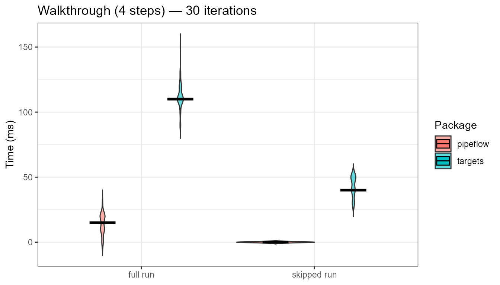
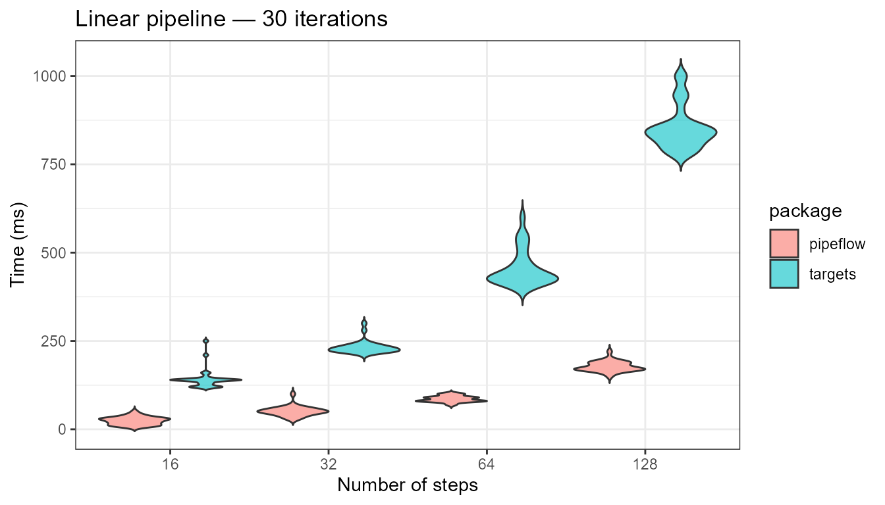
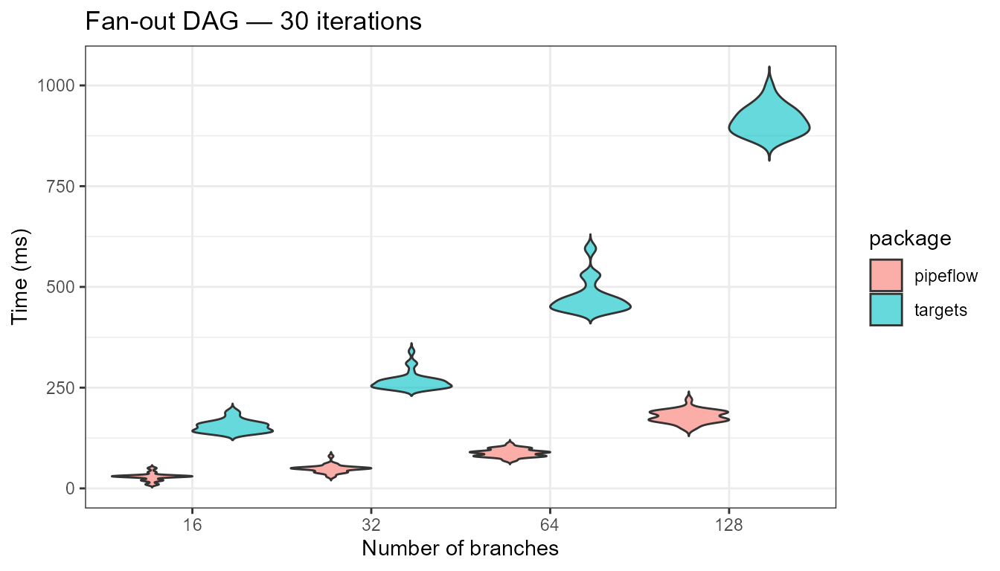

# pipeflow vs targets

## Overview

[{targets}](https://docs.ropensci.org/targets/) is the most widely used
pipeline toolkit in the R ecosystem and the de-facto standard for
heavy-duty reproducible workflows. The table below contrasts the two
packages to help you decide which one fits your project.

| Feature | **targets** | **pipeflow** |
|----|----|----|
| Paradigm | Declarative — define the full DAG upfront in a `_targets.R` script, then execute | Interactive — incrementally build the pipeline with [`pip_add()`](https://github.com/rpahl/pipeflow/reference/pip_add.md) as you code |
| Execution | `tar_make()` runs in a **fresh R process** | [`pip_run()`](https://github.com/rpahl/pipeflow/reference/pip_run.md) runs in the **current R session** |
| Dependencies | Heavy (~20+ packages: `tarchetypes`, `crew`, `qs`, etc.) | Minimal (`data.table`) |
| Learning curve | Steep — requires understanding `_targets.R` conventions, storage formats, cue rules | Shallow — R-native API with few concepts |
| Skip up-to-date steps | ✅ Hash-based invalidation of code and data | ✅ State-based (`done` / `outdated`) |
| Modify pipeline at runtime | ❌ Must edit `_targets.R` and re-run | ✅ [`pip_remove()`](https://github.com/rpahl/pipeflow/reference/pip_remove.md), [`pip_rename()`](https://github.com/rpahl/pipeflow/reference/pip_rename.md), [`pip_replace()`](https://github.com/rpahl/pipeflow/reference/pip_replace.md), insert with `after =` |
| Parameter management | ❌ No unified parameter view across targets | ✅ [`pip_get_params()`](https://github.com/rpahl/pipeflow/reference/pip_get_params.md) / [`pip_set_params()`](https://github.com/rpahl/pipeflow/reference/pip_set_params.md) — one call updates all steps |
| Split / map / reduce | Requires target factories (`tarchetypes`) or branching | ✅ Built-in `exec = "split"` / `"auto"` / `"reduce"` |
| Dynamic branching | ✅ Comprehensive via `tarchetypes` | ✅ Auto-mapping over partition keys (`exec = "auto"`) |
| Views / tag filtering | ❌ | ✅ [`pip_view()`](https://github.com/rpahl/pipeflow/reference/pip_view.md) — filter steps by tags, or index |
| Pipeline composition | ❌ | ✅ [`pip_bind()`](https://github.com/rpahl/pipeflow/reference/pip_bind.md) two pipelines, [`pip_add_from()`](https://github.com/rpahl/pipeflow/reference/pip_add_from.md) copy individual steps |
| Self-modifying pipelines | ❌ | ✅ `pip_run(recursive = TRUE)` — steps can return modified pipelines |
| Distributed computing | ✅ `crew` for HPC and cloud workers | ❌ (by design — stays lightweight and single-machine) |
| Cloud storage | ✅ AWS, GCS | ❌ |
| File tracking | ✅ File targets with `format = "file"` | ❌ |
| Step locking | ❌ | ✅ [`pip_lock()`](https://github.com/rpahl/pipeflow/reference/pip_lock.md) / [`pip_unlock()`](https://github.com/rpahl/pipeflow/reference/pip_unlock.md) — protect steps from accidental modification |

In short, **{targets}** is the tool of choice for large-scale, formally
reproducible projects that may run on distributed infrastructure.
**{pipeflow}** is designed for interactive development, rapid parameter
exploration, and projects where you want to modify the pipeline
structure as your analysis evolves — all while keeping a shallow
learning curve and minimal dependencies.

The benchmarks below provide a quantitative comparison on three pipeline
topologies. All timings are measured with
[`system.time()`](https://rdrr.io/r/base/system.time.html) across 30
iterations per scenario.

Package versions: pipeflow 0.2.3.9005, targets 1.12.0.

## Walkthrough example

Based on the [{targets}
walkthrough](https://books.ropensci.org/targets/walkthrough.html).

``` r

create_data_csv <- function(data = airquality, file = "data.csv") {
    utils::write.csv(data, file)
}

get_data <- function(file) {
    utils::read.csv(file) |> stats::na.omit()
}

fit_model <- function(data) {
    lm(Ozone ~ Temp, data) |> coefficients()
}

plot_model <- function(model, data) {
    ggplot(data) +
        geom_point(aes(x = Temp, y = Ozone)) +
        geom_abline(intercept = model[1], slope = model[2])
}
```

### pipeflow pipeline

``` r

tar_dir({
    create_data_csv(file = "data.csv")
    p <- pip_new("walkthrough") |>
        pip_add("data",  \(file = "data.csv") get_data(file)) |>
        pip_add("model", \(data = ~data) fit_model(data)) |>
        pip_add("plot",  \(model = ~model, data = ~data) plot_model(model, data))

    message("\nProof of principle full run (no skips)")
    pip_run(p)
    p_r <- replicate(nrep, elapsed_time(pip_run(p, lgr = NULL, force = TRUE)))

    message("\nProof of principle skipped run")
    pip_run(p)
    p_s <- replicate(nrep, elapsed_time(pip_run(p, lgr = NULL)))
})
# 
# Proof of principle full run (no skips)
# info [2026-06-13 15:09:58.590 UTC]: Start run of pipeflow_pip 'walkthrough'
# info [2026-06-13 15:09:58.590 UTC]: Step 1/3 data
# info [2026-06-13 15:09:58.595 UTC]: Step 2/3 model
# info [2026-06-13 15:09:58.600 UTC]: Step 3/3 plot
# info [2026-06-13 15:09:58.629 UTC]: Finished run of pipeflow_pip 'walkthrough'
# 
# Proof of principle skipped run
# info [2026-06-13 15:09:59.051 UTC]: Start run of pipeflow_pip 'walkthrough'
# info [2026-06-13 15:09:59.051 UTC]: Step 1/3 data - skipping done step
# info [2026-06-13 15:09:59.051 UTC]: Step 2/3 model - skipping done step
# info [2026-06-13 15:09:59.051 UTC]: Step 3/3 plot - skipping done step
# info [2026-06-13 15:09:59.051 UTC]: Finished run of pipeflow_pip 'walkthrough'
```

### targets pipeline

``` r

tar_make_here <- function(reporter = "silent") {
    tar_make(callr_function = NULL, reporter = reporter)
}

tar_dir({
    create_data_csv(file = "data.csv")
    tar_script({
        list(
            tar_target(file, "data.csv", format = "file"),
            tar_target(data, get_data(file)),
            tar_target(model, fit_model(data)),
            tar_target(plot, plot_model(model, data))
        )
    }, ask = FALSE)

    message("\nProof of principle full run (no skips)")
    tar_make_here(reporter = "timestamp")
    tar_r <- replicate(nrep, {
        tar_destroy(ask = FALSE)
        elapsed_time(tar_make_here(reporter = "silent"))
    })

    message("\nProof of principle skipped run")
    tar_make_here(reporter = "timestamp")
    tar_s <- replicate(nrep, {
        elapsed_time(tar_make_here(reporter = "silent"))
    })
})
# 
# Proof of principle full run (no skips)
# 2026-06-13 17:09:59.21 dispatched target file
# 2026-06-13 17:09:59.22 completed target file [0ms, 3.87 kB]
# 2026-06-13 17:09:59.23 dispatched target data
# 2026-06-13 17:09:59.25 completed target data [0ms, 1.38 kB]
# 2026-06-13 17:09:59.27 dispatched target model
# 2026-06-13 17:09:59.28 completed target model [0ms, 111 B]
# 2026-06-13 17:09:59.28 dispatched target plot
# 2026-06-13 17:09:59.33 completed target plot [20ms, 114.10 kB]
# ✔ 2026-06-13 17:09:59.34 ended pipeline [191ms, 4 completed, 0 skipped]
# 
# Proof of principle skipped run
# 2026-06-13 17:10:28.64 skipped 1 targets
# ✔ 2026-06-13 17:10:28.65 skipped pipeline [31ms, 4 skipped]
```

### Runtimes



## Long linear pipeline

Each step depends on the output of the previous step:
`s0 -> s1 -> s2 -> ... -> sN`. This measures the overhead of managing
the pipeline structure and skipping logic as the number of steps
increases.

### pipeflow pipeline

``` r

create_linear_pip <- function(n) {
    pip <- pip_new("linear") |> pip_add("s0", \(init = 0) init)

    for (i in seq_len(n)) {
        pip_add(pip, step = paste0("s", i), \(x = ~ -1) x + 1)
    }
    pip
}

# Verify
p <- create_linear_pip(3)
pip_run(p)
# info [2026-06-13 15:10:30.520 UTC]: Start run of pipeflow_pip 'linear'
# info [2026-06-13 15:10:30.520 UTC]: Step 1/4 s0
# info [2026-06-13 15:10:30.521 UTC]: Step 2/4 s1
# info [2026-06-13 15:10:30.525 UTC]: Step 3/4 s2
# info [2026-06-13 15:10:30.528 UTC]: Step 4/4 s3
# info [2026-06-13 15:10:30.531 UTC]: Finished run of pipeflow_pip 'linear'
stopifnot(p[["s3", "out"]] == 3)
```

### targets pipeline

``` r

create_linear_tar <- function(n) {
    init <- tar_target(s0, 0)
    rest <- lapply(
        seq_len(n),
        FUN = \(i) tar_target_raw(
            sprintf("s%d", i),
            call("+", as.symbol(sprintf("s%d", i - 1)), 1)
        )
    )
    c(list(init), rest)
}

# Verify
tar_dir({
    tar_script(create_linear_tar(3), ask = FALSE)
    tar_make_here(reporter = "timestamp")
    stopifnot(tar_read(s3) == 3)
})
# 2026-06-13 17:10:30.64 dispatched target s0
# 2026-06-13 17:10:30.64 completed target s0 [0ms, 49 B]
# 2026-06-13 17:10:30.64 dispatched target s1
# 2026-06-13 17:10:30.65 completed target s1 [0ms, 51 B]
# 2026-06-13 17:10:30.65 dispatched target s2
# 2026-06-13 17:10:30.66 completed target s2 [0ms, 50 B]
# 2026-06-13 17:10:30.66 dispatched target s3
# 2026-06-13 17:10:30.66 completed target s3 [0ms, 51 B]
# ✔ 2026-06-13 17:10:30.67 ended pipeline [61ms, 4 completed, 0 skipped]
# 
```

### Benchmark



## DAG with branching

A source feeds N parallel branches, all converging on a single sink
step. This tests scalability with fan-out structures.

``` r

dag_source <- function() 1
dag_branch <- function(x) x + 1
dag_sink   <- function(...) sum(...)
```

### pipeflow pipeline

``` r

make_branch_pip <- function(n) {
    pip <- pip_new("dag") |> pip_add("source", dag_source)
    for (i in seq_len(n))
        pip_add(pip, paste0("b", i), \(x = ~source) dag_branch(x))

    sink_args <- paste(
        sprintf("x%s = ~b%s", seq_len(n), seq_len(n)),
        collapse = ", "
    )
    sink_call <- paste(paste0("x", seq_len(n)), collapse = ", ")
    eval(parse(text = sprintf(
        "pip_add(pip, 'sink', function(%s) { dag_sink(%s) })",
        sink_args, sink_call
    )))
    invisible(pip)
}

p4 <- make_branch_pip(4); pip_run(p4)
# info [2026-06-13 15:11:33.901 UTC]: Start run of pipeflow_pip 'dag'
# info [2026-06-13 15:11:33.901 UTC]: Step 1/6 source
# info [2026-06-13 15:11:33.902 UTC]: Step 2/6 b1
# info [2026-06-13 15:11:33.903 UTC]: Step 3/6 b2
# info [2026-06-13 15:11:33.906 UTC]: Step 4/6 b3
# info [2026-06-13 15:11:33.907 UTC]: Step 5/6 b4
# info [2026-06-13 15:11:33.909 UTC]: Step 6/6 sink
# info [2026-06-13 15:11:33.911 UTC]: Finished run of pipeflow_pip 'dag'
stopifnot(p4[["sink", "out"]] == 8)
```

### targets pipeline

``` r

make_branch_tar <- function(n) {
    source <- tar_target(source, dag_source())
    branches <- lapply(
        seq_len(n),
        FUN = \(i) tar_target_raw(
            sprintf("b%d", i),
            call("dag_branch", as.symbol("source"))
        )
    )
    sink <- tar_target_raw(
        "sink",
        as.call(c(
            as.symbol("dag_sink"),
            lapply(paste0("b", seq_len(n)), as.symbol)
        ))
    )
    c(list(source), branches, list(sink))
}

# Verify
tar_dir({
    tar_script(make_branch_tar(4), ask = FALSE)
    tar_make_here()
    stopifnot(tar_read(sink) == 8)
})
```

### Benchmark


