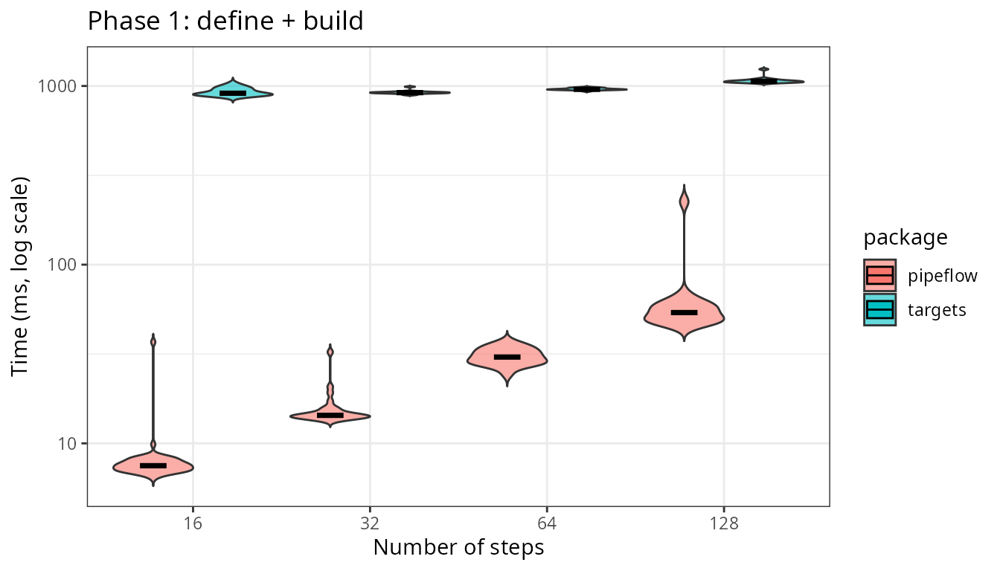
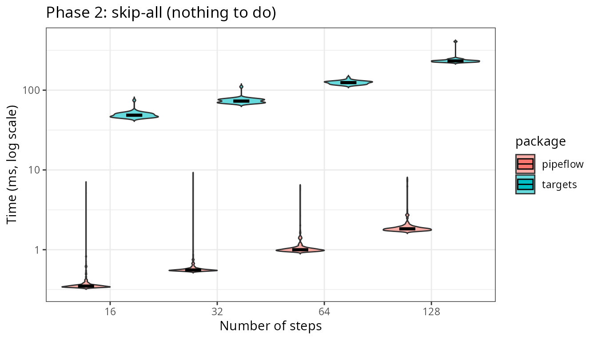
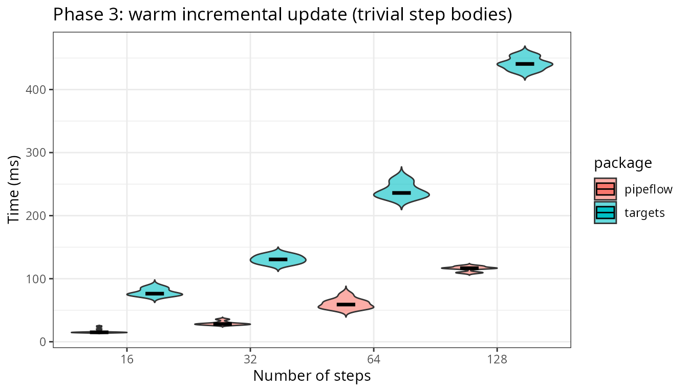
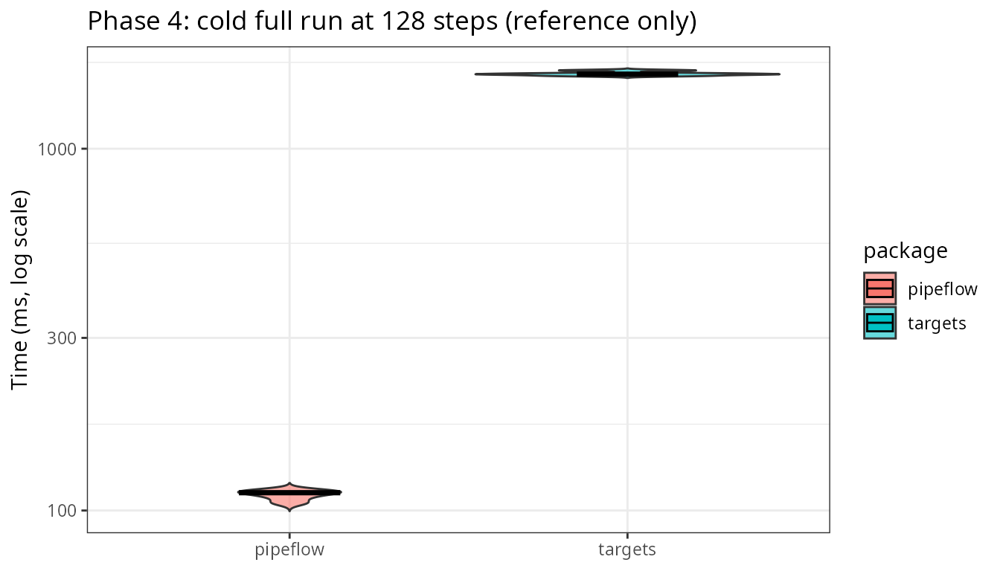
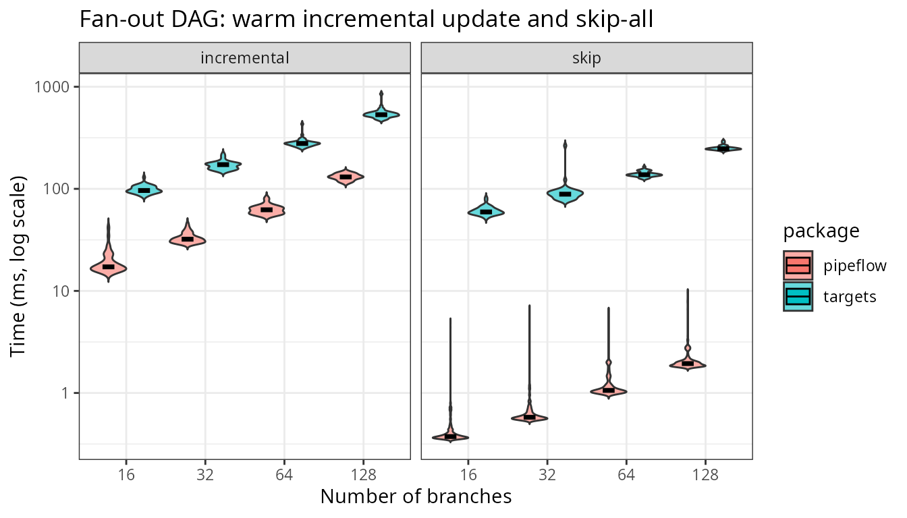

# pipeflow vs targets

This vignette has two parts. It opens with a [general, qualitative
comparison](#overview) of {pipeflow} and {targets} — what each package
is designed for and where they differ. It then tries to investigate
certain performance characteristics of the two packages in a
deliberately [scoped benchmark](#benchmark), which will mostly focus on
comparing the in-session interactive latency.

## General Properties

[{targets}](https://docs.ropensci.org/targets/) is the most widely used
pipeline toolkit in the R ecosystem and the de-facto standard for
heavy-duty reproducible workflows. The table below contrasts the two
packages to help you decide which one fits your project.

| Feature                    | **targets**                                                                                       | **pipeflow**                                                                                                                                                                                                                                                              |
|----------------------------|---------------------------------------------------------------------------------------------------|---------------------------------------------------------------------------------------------------------------------------------------------------------------------------------------------------------------------------------------------------------------------------|
| Paradigm                   | Declarative — define the full DAG upfront in a `_targets.R` script, then execute                  | Interactive — incrementally build the pipeline with [`pip_add()`](https://github.com/rpahl/pipeflow/reference/pip_add.md) as you code                                                                                                                                     |
| Execution                  | `tar_make()` runs in a **fresh R process** by default                                             | [`pip_run()`](https://github.com/rpahl/pipeflow/reference/pip_run.md) runs in the **current R session**                                                                                                                                                                   |
| Persistent storage         | ✅ Output stored to disk (`_targets/objects/`), survives R restarts, handles data larger than RAM | ❌ In-memory only                                                                                                                                                                                                                                                         |
| Skip up-to-date steps      | ✅ Hash-based invalidation of code and data                                                       | ✅ State-based (`done` / `outdated`)                                                                                                                                                                                                                                      |
| Metadata & provenance      | ✅ `tar_meta()` records runtime, size, errors per target                                          | ❌ No per-step provenance metadata (only the time of last execution)                                                                                                                                                                                                      |
| Dependency validation      | ✅ `tar_validate()` for pre-flight checks (opt-in)                                                | ✅ On [`pip_add()`](https://github.com/rpahl/pipeflow/reference/pip_add.md), [`pip_replace()`](https://github.com/rpahl/pipeflow/reference/pip_replace.md), [`pip_remove()`](https://github.com/rpahl/pipeflow/reference/pip_remove.md) — fails fast on broken references |
| Modify pipeline at runtime | ❌ Must edit `_targets.R` and re-run                                                              | ✅ [`pip_add()`](https://github.com/rpahl/pipeflow/reference/pip_add.md) insert with `after =`, [`pip_replace()`](https://github.com/rpahl/pipeflow/reference/pip_replace.md), [`pip_remove()`](https://github.com/rpahl/pipeflow/reference/pip_remove.md)                |
| Parameter management       | ❌ No unified parameter view across targets                                                       | ✅ [`pip_get_params()`](https://github.com/rpahl/pipeflow/reference/pip_set_params.md) / [`pip_set_params()`](https://github.com/rpahl/pipeflow/reference/pip_set_params.md) — one call updates all steps                                                                 |
| Split / map / reduce       | ✅ `pattern = map()` / `cross()` built-in, `tarchetypes` for advanced patterns                    | ✅ Built-in `exec = "split"` / `"auto"` / `"reduce"`                                                                                                                                                                                                                      |
| Dynamic branching          | ✅ Comprehensive via `tarchetypes`                                                                | ✅ Auto-mapping over partition keys (`exec = "auto"`)                                                                                                                                                                                                                     |
| Views / tag filtering      | ✅ `tar_described_as()` selects by description tags                                               | ✅ [`pip_view()`](https://github.com/rpahl/pipeflow/reference/pip_view.md) and the `[` operator — filter by tags, step names, state, or boolean expressions                                                                                                               |
| Pipeline composition       | ❌                                                                                                | ✅ [`rbind()`](https://rdrr.io/r/base/cbind.html) any number of pipelines                                                                                                                                                                                                 |
| Nested pipelines           | ❌                                                                                                | ✅ Steps can embed and run nested pipelines — reuse standalone pipelines as building blocks                                                                                                                                                                               |
| Self-modifying pipelines   | ❌                                                                                                | ✅ Steps can modify the pipeline at runtime via `.self` (add/remove/replace steps, set params) and restart the run with `.self$restart()`                                                                                                                                 |
| Distributed computing      | ✅ `crew` for HPC and cloud workers                                                               | ❌                                                                                                                                                                                                                                                                        |
| Cloud storage              | ✅ AWS, GCS                                                                                       | ❌                                                                                                                                                                                                                                                                        |
| File tracking              | ✅ File targets with `format = "file"`                                                            | ❌                                                                                                                                                                                                                                                                        |
| Step locking               | ❌                                                                                                | ✅ [`pip_lock()`](https://github.com/rpahl/pipeflow/reference/pip_lock.md) / [`pip_unlock()`](https://github.com/rpahl/pipeflow/reference/pip_lock.md) — protect steps from accidental modification                                                                       |
| Visualization / monitoring | ✅ `tar_visnetwork()`, `tar_glimpse()`, `tar_watch()` (live Shiny app)                            | ✅ [`pip_graph()`](https://github.com/rpahl/pipeflow/reference/pip_graph.md) → visNetwork                                                                                                                                                                                 |

In short, **{targets}** is the tool of choice for large-scale
reproducible projects: it persists results to disk, captures provenance
with `tar_meta()`, and scales to distributed infrastructure via `crew`.
**{pipeflow}** prioritises simplicity, interactivity, and flexibility:
in-session pipeline modification, and low response times make it well
suited for Shiny backends or rapid parameter exploration during
analysis.

## The benchmark: what we measure

The comparison in this vignette is deliberately scoped. It does *not*
claim that pipeflow is generally “faster at pipelines” but rather is
focussing specifically on the in-session interactive latency of each
package. We ask how long does a running R session take to:

- declare a pipeline
- check whether anything needs to run, and
- refresh the affected steps after a change

This covers the typical Shiny / parameter-exploration use case pipeflow
is built for. For reference we also report the [cold full end-to-end
run](#cold-ref)), which is not to be interpreted head-to-head but rather
as a demonstration of the different cost models of the two packages.

Each operation is timed as its own, clearly scoped phase:

| Phase                         | pipeflow                                                                                                                                                    | targets                                                            |
|-------------------------------|-------------------------------------------------------------------------------------------------------------------------------------------------------------|--------------------------------------------------------------------|
| **Define + build**            | [`pip_new()`](https://github.com/rpahl/pipeflow/reference/pip_new.md) + [`pip_add()`](https://github.com/rpahl/pipeflow/reference/pip_add.md) loop          | write `_targets.R`, then graph build (`tar_manifest()`)            |
| **Skip-all**                  | [`pip_run()`](https://github.com/rpahl/pipeflow/reference/pip_run.md) — all steps `done`                                                                    | `tar_make()` — all targets up to date                              |
| **Warm incremental**          | [`pip_set_params()`](https://github.com/rpahl/pipeflow/reference/pip_set_params.md) + [`pip_run()`](https://github.com/rpahl/pipeflow/reference/pip_run.md) | edit parameter in `_targets.R` + `tar_make(callr_function = NULL)` |
| **Cold full run** (reference) | `pip_run(force = TRUE)`                                                                                                                                     | `tar_destroy()` + default `tar_make()` (fresh process)             |

All phases run in the current R session, except the cold reference,
where targets uses its default fresh-process execution. targets
re-sources `_targets.R` and rebuilds its graph on *every* `tar_make()`
and `tar_manifest()` call — that fixed per-run cost is part of its
in-session latency and is measured here. pipeflow has no equivalent: its
graph is the in-memory object built once by
[`pip_add()`](https://github.com/rpahl/pipeflow/reference/pip_add.md).

### Measurement method

- [`bench::mark()`](https://bench.r-lib.org/reference/mark.html) is used
  with `check = FALSE` (the two expressions return different objects by
  design), `memory = FALSE`, and `filter_gc = FALSE`.
- Each expression is evaluated once and discarded before timing, as an
  explicit warmup.
- since [`bench::mark()`](https://bench.r-lib.org/reference/mark.html)
  does *not* randomize expressions, every comparison is run twice, with
  the argument order swapped, and the per-iteration times pooled.
- Each expression runs for at least `mi` (= 20) iterations and
  `min_time` seconds, capped at `max_iterations`.
- targets is run in the current session (`callr_function = NULL`) for
  all phases except the cold reference.
- The targets store lives in a fresh temporary directory (`tar_dir()`)
  on the same disk for every run.

## The operations, in miniature

Here are the pieces being benchmarked on a three-step linear pipeline.

Show code

``` r
# ---- pipeflow: linear pipeline --------------------------------------------
create_linear_pip <- function(n, flavor = "trivial", work = 0.005) {
    pip <- pip_new("linear") |> pip_add("s0", \(init = 0) init)
    for (i in seq_len(n)) {
        if (flavor == "costly") {
            pip_add(
                pip,
                step = sprintf("s%d", i),
                \(x = ~ -1) {
                    Sys.sleep(work)
                    x + 1
                }
            )
        } else {
            pip_add(pip, step = sprintf("s%d", i), \(x = ~ -1) x + 1)
        }
    }
    pip
}

# ---- targets: linear pipeline script --------------------------------------
linear_script <- function(n, flavor = "trivial", work = 0.005, init = 0) {
    lines <- c(
        "library(targets)",
        "list(",
        sprintf("    tar_target(s0, %s),", init)
    )
    for (i in seq_len(n)) {
        prev <- sprintf("s%d", i - 1)
        if (flavor == "costly") {
            body <- sprintf(
                paste0(
                    "    tar_target_raw(\"s%d\", quote({ Sys.sleep(%s);",
                    " %s + 1 }))"
                ),
                i, format(work, scientific = FALSE), prev
            )
        } else {
            body <- sprintf(
                "    tar_target_raw(\"s%d\", quote(%s + 1))", i, prev
            )
        }
        comma <- if (i == n) "" else ","
        lines <- c(lines, paste0(body, comma))
    }
    c(lines, ")")
}

# ---- shared ---------------------------------------------------------------
tar_make_silent <- function() {
    tar_make(callr_function = NULL, reporter = "silent")
}

# Each call flips between 0 and 1, so consecutive evaluations of the same
# package always see a genuinely new parameter value. One toggle per package,
# because the benchmark interleaves evaluations of the two packages.
counter <- function() {
    k <- 0L
    function() {
        k <<- 1L - k
        k
    }
}

# One discarded evaluation of each expression before timing.
warmup <- function(exprs, env) {
    for (e in exprs) {
        eval(e, env)
    }
    invisible(NULL)
}

# Turn a bench::mark() result into long (package, time[s]) data.
mark_times <- function(mark_res) {
    times <- mark_res$time
    data.frame(
        package = rep(as.character(mark_res$expression), times = lengths(times)),
        time = as.numeric(unlist(times)),
        stringsAsFactors = FALSE
    )
}

# Benchmark two named quoted expressions in both orders and pool the
# per-iteration times.
bench_pair <- function(exprs, env, min_iterations, min_time = 0.2,
                       max_iterations = 1000L) {
    stopifnot(length(exprs) == 2L, !is.null(names(exprs)))
    run <- function(e) {
        mark_times(bench::mark(
            exprs = e,
            env = env,
            check = FALSE,
            memory = FALSE,
            filter_gc = FALSE,
            min_iterations = min_iterations,
            min_time = min_time,
            max_iterations = max_iterations
        ))
    }
    rbind(run(exprs), run(exprs[rev(seq_along(exprs))]))
}

run_phase <- function(exprs, env, n, phase, min_iterations, min_time = 0.2,
                      max_iterations = 1000L) {
    warmup(exprs, env)
    d <- bench_pair(
        exprs, env,
        min_iterations, min_time = min_time, max_iterations = max_iterations
    )
    d$n <- n
    d$phase <- phase
    d
}

# ---- verify pipelines ----------------------------------------------------
# pipeflow, trivial bodies
p <- create_linear_pip(3)
pip_run(p, lgr = NULL)
stopifnot(p[["s3", "out"]] == 3)

# pipeflow, costly bodies
p_costly <- create_linear_pip(3, flavor = "costly", work = 0.001)
pip_run(p_costly, lgr = NULL)
stopifnot(p_costly[["s3", "out"]] == 3)

# targets, trivial and costly bodies
tar_dir({
    writeLines(linear_script(3), "_targets.R")
    tar_make_silent()
    stopifnot(tar_read(s3) == 3)

    writeLines(linear_script(3, flavor = "costly", work = 0.001),
               "_targets.R")
    tar_make_silent()
    stopifnot(tar_read(s3) == 3)
})
```

The mini-pipelines build and run correctly in both packages, with
trivial and costly step bodies alike. Let’s see what happens after a
change at the head of the chain:

``` r
# pipeflow: change one parameter, refresh affected steps
pip_set_params(p, list(init = 1))
print(p)
# <pipeflow> linear (4 steps)
# ---------------------------
#    step params depends    state out
# 1:   s0   init         outdated   0
# 2:   s1      x      s0 outdated   1
# 3:   s2      x      s1 outdated   2
# 4:   s3      x      s2 outdated   3
# ---------------------------
# <ready> last run: 2026-10-02 20:37:45
pip_run(p, lgr = NULL)

# pipeflow: everything up to date -> skip-all
pip_run(p, lgr = NULL)

# targets: edit parameter in _targets.R, refresh affected steps
tar_dir({
    writeLines(linear_script(3, init = 1), "_targets.R")
    tar_make_silent()
})
```

Both packages re-run only the steps affected by the change (the whole
chain, in a linear pipeline), and both skip everything when the pipeline
is up to date. These are the two operations we time in phases 2 and 3.

## Phase 1 — Define and build

How long does it take to declare a pipeline? For pipeflow, that is the
[`pip_add()`](https://github.com/rpahl/pipeflow/reference/pip_add.md)
loop itself. For targets, it is writing the target script plus the graph
build that `tar_manifest()` performs[¹](#fn1).



Declaring the pipeline is roughly 20 to 121 times faster in pipeflow
across the four sizes, and the gap widens with `n`. Again, the targets
bar covers writing `_targets.R` and the parse and graph build that
`tar_manifest()` performs once here and then on every run.

## Phase 2 — Skip-all

The closest thing to an apples-to-apples comparison: everything is
already up to date, and we time a no-op run.



pipeflow’s skip check stays at or below 1.93 ms even at 128 steps.
targets pays its per-run script re-source and graph rebuild even when no
target runs. That fixed cost is what a targets user pays on *every*
`tar_make()` in an interactive session — it buys the persistent,
provenance-tracking store.

## Phase 3 — Warm incremental update

Scenario: the pipeline is up to date, a single parameter changed, and we
measure the time until all affected steps are refreshed. Each iteration
changes the source value (pipeflow via
[`pip_set_params()`](https://github.com/rpahl/pipeflow/reference/pip_set_params.md)
and targets by editing the value in `_targets.R`), so both packages
re-run the same affected steps.

### Trivial step bodies

Since with trivial step bodies almost nothing is computed in the steps,
we are basically measuring the pure framework overhead, which is the
graph traversal and state bookkeeping in pipeflow vs the per-run graph
rebuild and per-step bookkeeping in targets.



### Non-trivial step bodies

To simulate some real work in the step bodies, we add an additional
fixed cost of `5 ms` per step so that each full cascade performs
`n * 5 ms` of known work.


Once steps do real work, as expected, the update time is increasingly
dominated by the work itself, and the two packages are starting to
converge.

## Phase 4 — Cold full run (reference, not a race)

For completeness, here is the cold end-to-end rebuild. It is *not* a
head-to-head: pipeflow re-runs in a warm in-memory session, while
targets destroys its store and runs in a fresh R process, persisting
every object to disk with provenance. That is targets’ design and its
home turf — the bar shows the magnitude of its cost model, not a defect.

This time the teardown is kept out of the timed region: `tar_destroy()`
runs before each timed `tar_make()`.



## Does the story change with wide graphs?

We create `n` parallel branches that converge on one sink and time the
same two phases — skip-all and warm incremental — with trivial bodies.

Show code

``` r
dag_source <- function() 1
dag_branch <- function(x) x + 1
dag_sink <- function(...) sum(...)

make_branch_pip <- function(n) {
    pip <- pip_new("dag") |>
        pip_add("source", \(init = 0) dag_source() + init)
    for (i in seq_len(n)) {
        pip_add(pip, sprintf("b%d", i),
                \(x = ~source) dag_branch(x))
    }
    args <- as.pairlist(stats::setNames(
        lapply(paste0("b", seq_len(n)), \(s) {
            stats::as.formula(paste0("~", s))
        }),
        paste0("x", seq_len(n))
    ))
    body <- as.call(c(
        list(as.symbol("dag_sink")),
        lapply(paste0("x", seq_len(n)), as.symbol)
    ))
    sink_fun <- eval(call("function", args, body))
    pip_add(pip, "sink", sink_fun)
}

branch_script <- function(n, init = 0) {
    branches <- vapply(seq_len(n), function(i) {
        sprintf(
            "    tar_target_raw(\"b%d\", quote(dag_branch(source))),",
            i
        )
    }, character(1))
    sink_line <- sprintf(
        "    tar_target_raw(\"sink\", quote(dag_sink(%s)))",
        paste(paste0("b", seq_len(n)), collapse = ", ")
    )
    c(
        "library(targets)",
        "dag_source <- function() 1",
        "dag_branch <- function(x) x + 1",
        "dag_sink <- function(...) sum(...)",
        "list(",
        sprintf("    tar_target(source, dag_source() + %s),", init),
        branches,
        sink_line,
        ")"
    )
}

# Verify the wide-graph pipelines build and run correctly in both packages.
p4 <- make_branch_pip(4)
pip_run(p4, lgr = NULL)
stopifnot(p4[["sink", "out"]] == 8)

tar_dir({
    writeLines(branch_script(4), "_targets.R")
    tar_make_silent()
    stopifnot(tar_read(sink) == 8)
})
```



Overall, wide graphs do not change the picture. The skip checks stay
sub-millisecond in pipeflow, and the incremental update scales with the
number of re-run steps while targets carries its fixed per-run rebuild.

## What the numbers include

The bars above are *not* all measuring the same thing. This table states
explicitly what each phase does and does not include.

| Bar                  | Step bodies run | Process             | Disk persistence | Provenance | Store               |
|----------------------|-----------------|---------------------|------------------|------------|---------------------|
| pipeflow skip-all    | none            | current session     | no               | no         | in-memory           |
| targets skip-all     | none            | current session     | yes              | yes        | on-disk `_targets/` |
| pipeflow incremental | affected steps  | current session     | no               | no         | in-memory           |
| targets incremental  | affected steps  | current session     | yes              | yes        | on-disk `_targets/` |
| pipeflow cold (ref)  | all steps       | current session     | no               | no         | in-memory           |
| targets cold (ref)   | all steps       | **fresh R process** | yes              | yes        | on-disk `_targets/` |

In short: targets’ overhead buys disk persistence, provenance, and
distributed execution; pipeflow’s buys in-session latency. The benchmark
above is a latency comparison, and the numbers only make sense with that
caveat attached.

## Summary

- **Skip-all** (Phase 2) is the closest apples-to-apples comparison:
  while pipeflow’s skip check is sub-millisecond, targets’ is dominated
  by its per-run graph rebuild.
- **Warm incremental** (Phase 3) is the fairest measure of *interactive*
  latency: pipeflow scales with the re-run steps, targets carries a
  fixed per-run cost, and with real per-step work the two converge.
- **Cold full run** (Phase 4) reported as reference only: targets’
  fresh-process, disk-persisting rebuild is its home turf, not a race
  pipeflow can run.
- Treat these as *latency* numbers, not a general speed ranking. A
  targets run that saves hours of recomputation or runs across `crew`
  workers will win the only race that matters for heavy workloads — and
  pipeflow will never claim that ground.

Finally, it is worth noting that while this benchmark was mostly focused
on sparse step bodies to investigate framework overhead, pipeflow is
well equipped to handle more realistic workloads too. Here, two
implementation choices matter: while the dependency graph is implemented
in C++ and therefore capable of handling large graphs efficiently, the
step and parameter bookkeeping is backed by {data.table}, which provides
outstanding memory management and reference semantics. Those advantages
grow with the size and edit frequency of real pipelines, where in-place
updates avoid copying and keep re-runs cheap.

## Session info

    # R version 4.5.3 (2026-03-11)
    # Platform: x86_64-pc-linux-gnu
    # Running under: Ubuntu 24.04.4 LTS
    # 
    # Matrix products: default
    # BLAS:   /usr/lib/x86_64-linux-gnu/openblas-pthread/libblas.so.3 
    # LAPACK: /usr/lib/x86_64-linux-gnu/openblas-pthread/libopenblasp-r0.3.26.so;  LAPACK version 3.12.0
    # 
    # locale:
    #  [1] LC_CTYPE=C.UTF-8       LC_NUMERIC=C           LC_TIME=C.UTF-8        LC_COLLATE=C.UTF-8    
    #  [5] LC_MONETARY=C.UTF-8    LC_MESSAGES=C.UTF-8    LC_PAPER=C.UTF-8       LC_NAME=C             
    #  [9] LC_ADDRESS=C           LC_TELEPHONE=C         LC_MEASUREMENT=C.UTF-8 LC_IDENTIFICATION=C   
    # 
    # time zone: Etc/UTC
    # tzcode source: system (glibc)
    # 
    # attached base packages:
    # [1] stats     graphics  grDevices datasets  utils     methods   base     
    # 
    # other attached packages:
    # [1] ggplot2_4.0.3  bench_1.1.4    targets_1.12.0 pipeflow_0.4.0
    # 
    # loaded via a namespace (and not attached):
    #  [1] sass_0.4.10         generics_0.1.4      renv_1.2.3          digest_0.6.39      
    #  [5] magrittr_2.0.5      evaluate_1.0.5      grid_4.5.3          RColorBrewer_1.1-3 
    #  [9] fastmap_1.2.0       jsonlite_2.0.0      processx_3.9.0      backports_1.5.1    
    # [13] secretbase_1.2.2    ps_1.9.3            BiocManager_1.30.27 scales_1.4.0       
    # [17] codetools_0.2-20    textshaping_1.0.5   jquerylib_0.1.4     cli_3.6.6          
    # [21] rlang_1.2.0         withr_3.0.2         cachem_1.1.0        yaml_2.3.12        
    # [25] otel_0.2.0          tools_4.5.3         dplyr_1.2.1         base64url_1.4      
    # [29] vctrs_0.7.3         R6_2.6.1            lifecycle_1.0.5     fs_2.1.0           
    # [33] htmlwidgets_1.6.4   ragg_1.5.2          pkgconfig_2.0.3     desc_1.4.3         
    # [37] callr_3.7.6         pkgdown_2.2.0       pillar_1.11.1       bslib_0.11.0       
    # [41] gtable_0.3.6        data.table_1.18.6.1 glue_1.8.1          Rcpp_1.1.1-1.1     
    # [45] systemfonts_1.3.2   xfun_0.57           tibble_3.3.1        tidyselect_1.2.1   
    # [49] rstudioapi_0.18.0   knitr_1.51          farver_2.1.2        htmltools_0.5.9    
    # [53] igraph_2.3.2        labeling_0.4.3      rmarkdown_2.31      compiler_4.5.3     
    # [57] prettyunits_1.2.0   S7_0.2.2

------------------------------------------------------------------------

1.  Note that targets pays this graph build on *every* `tar_make()`
    call, not just at definition time.
