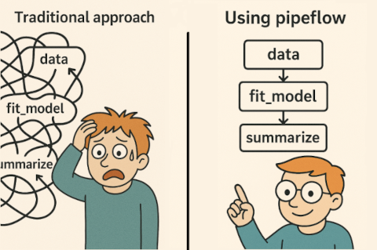

# pipeflow

Build fast interactive data analysis pipelines quick and easy.

{pipeflow} simply lets you add R functions one by one, wiring them into
a pipeline that stays consistent as you go. Modify, remove, or insert
steps at any stage, and manage all parameters in one place.

Thanks to its intuitive interface, using {pipeflow} quickly pays off in
the beginning while in the long run helps keeping a clear and structured
overview of your project.



### Why use {pipeflow}

- Lightweight and intuitive API
- Filtered pipeline views
- All parameters managed in one place
- Pipeline verified at definition time
- Execution remains fast for complex pipelines (C++-powered DAG)

### Installation

``` r

# Install release version from CRAN
install.packages("pipeflow")

# Install development version from GitHub
devtools::install_github("rpahl/pipeflow")
```

### Usage

``` r

library(pipeflow)

p <- pip_new("demo") |>
    pip_add("numbers", \(n = 5) seq_len(n)) |>
    pip_add("squared", \(x = ~numbers) x^2) |>
    pip_add("total",   \(x = ~squared) sum(x))

p
# <pipeflow_pip> demo (3 steps)
# -----------------------------
#       step depends    out state
# 1: numbers         [NULL]   new
# 2: squared numbers [NULL]   new
# 3:   total squared [NULL]   new

pip_run(p)
# info [2026-06-14 20:16:14.083 UTC]: Start run of pipeflow_pip 'demo'
# info [2026-06-14 20:16:14.084 UTC]: Step 1/3 numbers
# info [2026-06-14 20:16:14.086 UTC]: Step 2/3 squared
# info [2026-06-14 20:16:14.088 UTC]: Step 3/3 total
# info [2026-06-14 20:16:14.090 UTC]: Finished run of pipeflow_pip 'demo'

pip_collect_out(p)
# $numbers
# [1] 1 2 3 4 5
# 
# $squared
# [1]  1  4  9 16 25
# 
# $total
# [1] 55
```

### Getting Started

It is recommended to read the vignettes in the order they are listed
below:

- [Get started with
  pipeflow](https://rpahl.github.io/pipeflow/articles/v01-get-started.html)
- [Modifying existing
  pipelines](https://rpahl.github.io/pipeflow/articles/v02-modify-pipeline.html)
- [Combining
  pipelines](https://rpahl.github.io/pipeflow/articles/v03-combine-pipelines.html)
- [Collecting and filtering
  output](https://rpahl.github.io/pipeflow/articles/v04-collect-output.html)

### Advanced topics

- [Split, map, and
  reduce](https://rpahl.github.io/pipeflow/articles/v05-split-map-reduce.html)
- [Recursive
  self-modification](https://rpahl.github.io/pipeflow/articles/v06-self-modify-pipeline.html)

### Benchmarks

- [pipeflow vs
  targets](https://rpahl.github.io/pipeflow/articles/articles/v07-vs-targets.html)
