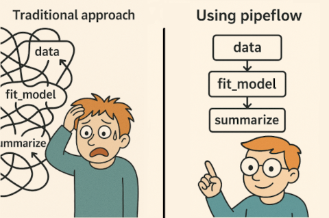

# pipeflow

Build fast interactive data analysis pipelines that scale.

{pipeflow} simply lets you add R functions one by one, wiring them into
a pipeline that stays consistent as you go. Modify, remove, or insert
steps at any stage, and manage all parameters in one place.

Thanks to its intuitive interface, using {pipeflow} quickly pays off in
the beginning while in the long run helps keeping a clear and structured
overview of your project.



### Why use {pipeflow}

- Lightweight and intuitive API
- All parameters managed in one place
- Pipeline verified at definition time
- Filter pipeline steps via views
- Branch and merge pipeline steps
- Fast dependency resolution (C++-powered DAG)
- Subset pipelines with data.table-style `[` filters
  
- Embed reusable workflows in steps (nested pipelines)
  

### Installation

``` r
# Install release version from CRAN
install.packages("pipeflow")

# Install development version from GitHub
devtools::install_github("rpahl/pipeflow")
```

### Usage

``` r
library(pipeflow)

p <- pip_new("demo") |>
    pip_add("numbers", \(n = 5) seq_len(n)) |>
    pip_add("squared", \(x = ~numbers) x^2) |>
    pip_add("total", \(x = ~squared) sum(x))

p
# <pipeflow> demo (3 steps)
# -------------------------
#       step params depends state
# 1: numbers      n           new
# 2: squared      x numbers   new
# 3:   total      x squared   new
# -------------------------
# <ready> last run: never

pip_run(p)
# info [2026-09-27 14:59:46.748 UTC]: Starting run of pipeflow 'demo'
# info [2026-09-27 14:59:46.748 UTC]: Step 1/3 numbers
# info [2026-09-27 14:59:46.750 UTC]: Step 2/3 squared
# info [2026-09-27 14:59:46.752 UTC]: Step 3/3 total
# info [2026-09-27 14:59:46.753 UTC]: Finished run of pipeflow 'demo'

pip_collect(p)
# $numbers
# [1] 1 2 3 4 5
# 
# $squared
# [1]  1  4  9 16 25
# 
# $total
# [1] 55
```

### Getting Started

It is recommended to read the vignettes in the order they are listed
below:

- [Get started with
  pipeflow](https://rpahl.github.io/pipeflow/articles/v01-get-started.html)
- [Modify existing
  pipelines](https://rpahl.github.io/pipeflow/articles/v02-modify-pipeline.html)
- [Combine
  pipelines](https://rpahl.github.io/pipeflow/articles/v03a-combine-pipelines.html)
- [Pipeline
  views](https://rpahl.github.io/pipeflow/articles/v03b-pipeline-views.html)
- [Collect and group
  output](https://rpahl.github.io/pipeflow/articles/v04-collect-output.html)

### Advanced workflows

- [Split, map, and
  reduce](https://rpahl.github.io/pipeflow/articles/v05a-split-map-reduce.html)
- [Nested
  pipelines](https://rpahl.github.io/pipeflow/articles/v05b-nested-pipeline.html)
- [Self-modifying
  pipelines](https://rpahl.github.io/pipeflow/articles/v06-self-modify-pipeline.html)

### Benchmarks

- [pipeflow vs
  targets](https://rpahl.github.io/pipeflow/articles/v07-vs-targets.html)
